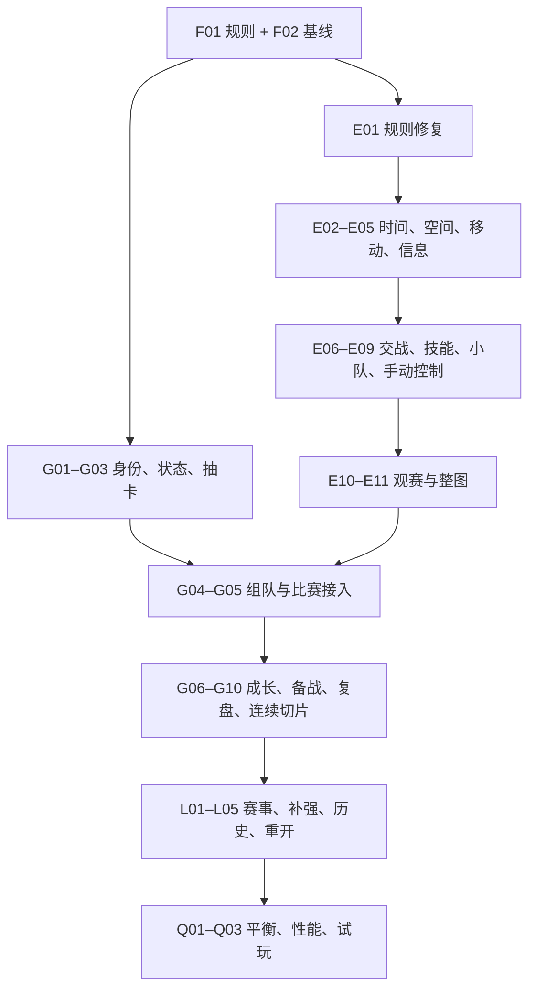

# 游戏玩法与比赛引擎优化实施计划

> **2026-10-01 规则替代说明**：本计划仅保留旧版实施记录。当前征战规则、代码缺口和后续顺序见[新版重做稿](../../设计文档/01_当前设计/征战模式重做定案与待确认事项.md)；旧成长选择及卡牌构筑任务不再是新版验收条件。

> 执行说明：按任务依赖逐项实施、验证、更新状态；可使用已安装的 executing-plans 技能。2026-09-24 已开始编码；下方状态表说明已完成与部分完成的范围。本轮不接入 Jev。

> 2026-09-26 设计修订：试玩后形成[征战、收藏与比赛决策完整系统方案](../../设计文档/90_历史归档/征战收藏与比赛决策完整系统方案.md)。其中临时征召／永久收藏、阵容费用、有限战术指令、成长节点和模式边界属于下一版提案，尚未写入代码。本文件继续记录旧版实施状态；下一版按新方案的 A–D 批次细化，不能把旧版已完成项当成新规格验收通过。

**Goal:** 让玩家用每次随机获得的选手组队，在可信的二维比赛中亲自指挥，通过随机成长与阶段补强完成一个有结果、可重开的联赛征程。

**Architecture:** 本地规则引擎负责空间、信息、动作和胜负，小队计划组织选手执行；观赛读取同一引擎的事件与位置。独立的游戏状态层管理卡库、征程、成长、赛历和存档，界面只提交命令、展示结果。所有随机系统分流记录，成长不能修改原始卡牌数据。

**Tech Stack:** 复用现有 JavaScript/CommonJS、Node.js 模拟工具、JSON 数据及 HTML/CSS/JS 原型；测试优先使用 Node 内置 `node:test`。存档建议 IndexedDB，纯规则与浏览器持久化分离；不以更换框架为前提。

---

## 1. 计划口径与范围

- 日期：2026-09-23。本清单是当前实施顺序的唯一入口，取代旧文档中相互冲突的下一步建议。
- 已确认方向：每次随机开包建队、征程内随机/阶段成长、教练布置与调整、联赛成绩、回合 2D 可视化推演；当前优先改善比赛真实感。
- 当前工作范围明确排除 Jev 及其他外部决策模型：不做 API、服务端代理、模型评估或模型专用适配。旧 Jev 评估保留作研究记录。
- 以下内容数量、赛制和默认规则属于**建议测试规格**；F01 落成配置后再按试玩证据调整，不冒充已确认的最终规则。
- 复用已有卡面、抽卡演出、卡池、经济/心态基础、模拟器与观赛工具；分步替换过粗的结算机制。
- 2026-09-24 首批规则修复已实施并复测；旧审计数据保留在 `引擎/BASELINE_2D.md`。其余任务以本表状态为准，未列为完成的不代表可玩版功能已就绪。

### 1.1 执行状态（2026-09-24）

| 状态 | 任务 | 已交付边界 |
|---|---|---|
| 已完成 | F01、F02、E01 | 测试规则与配置、场景基线、下拆包/同步进点修复 |
| 部分完成 | E02–E11 | 可逐回合推进；A 点局部二维几何、移动暴露、视野记忆、烟遮挡、HP/弹药/装填、延迟补枪、职责分配和手动教练已落地。事件日志可在不重跑引擎的情况下重建位置、生命与复活回放。仍是一秒逻辑 tick，完整地图沿用节点交火；技能时序、小队失败分支、权威快照和整图二维化尚未达到 M1 验收 |
| 部分完成 | G01–G10 | 普通/钻卡身份、十张开包、本轮库存、阵容/职责、备战、四场比赛、成长/阶段补强、战报、存档与网页入口均已有可运行路径；仍需卡面能力覆盖核对、更多内容和真实浏览器操作验收 |
| 部分完成 | Q01–Q02 | 500 场节点图平衡与约 65 场/秒无渲染吞吐已记录，见 `引擎/BALANCE_2026-09-24.md`；最终二维版平衡和浏览器帧率未测 |
| 部分完成 | L01–L02、L05 | 官方 2026 VCT CN Stage 1 赛制/分组来源已核对但未冻结为游戏赛制；当前五队虚构测试榜让其他队真实模拟、按赛果排名并在生涯页展示历次名次与比分，跨局重开已通。正式 BO3/双败、队伍阵容快照和资格规则仍未实现 |
| 待开始 | L03–L04、Q03 | 正式系列赛与地图 BP、转会补强、真实玩家试玩尚未实施；四场切片不能冒充正式联赛 |

当前 70 项自动测试、网页规则包一致性与观赛打包器自检通过。生成的四场测试入口见 `游戏/out/playable.html`，说明见 `游戏/README.md`；浏览器本地 URL 检查被工具安全策略拦截，未执行实际页面与 IndexedDB 操作验收。单包点几何只在显式提供 overlay 的场景生效；完整 `ascent.json` 尚未启用完整二维地图。生成的独立观赛预览见 `引擎/out/coach_plan_preview.html`。单独把宏观路线改为最短时间会显著恶化攻方与假打平衡，已撤回，数据见 `引擎/BALANCE_2026-09-24.md`。

### 1.2 保留、修改、新增、后置

| 分类 | 内容 |
|---|---|
| 保留 | 随机开包；真实选手数据与卡面；每队最多一钻与同名互斥方向；现有 Web 形态；本地模拟；玩家指挥 |
| 修改 | 区域移动升级为二维位置；直接概率击杀升级为动作/伤害；独立个体行动增加小队协作；假数据页面改为真实状态；固定比分改为实际赛果 |
| 新增 | 征程状态/存档；统一卡牌身份；有效成长选项；阶段奖励；完整赛历；赛事失败分支；成长/战术执行证据；长期历史与新征程重置 |
| 后置 | 外部模型、完整赛年/国际赛、全部地图和特工技能细节、全量钻卡机制、永久数值养成、合同薪资、复杂伤病、日常活动、付费系统、联网 PVP |

## 2. 玩家完整流程与应有的选择

新征程 → 固定额度随机开包 → 从本次库存选五人/特工/IGL → 选开局专长 → 看下一场与对手 → 有限备战 → 确认计划 → 2D 观赛与教练窗口 → 真实复盘 → 随机成长 → 阶段大成长/有限补强 → 下一场 → 征程结算 → 保留图鉴荣誉、重置实战构筑 → 重新开局。

| 环节 | 优化后的决定 | 玩家必须看见的反馈 | 防止的错位 |
|---|---|---|---|
| 开包建队 | 强选手与功能适配如何取舍 | 合法人数、英雄池、职责缺口、可用库存 | 图鉴被当作永久实战卡库；开局无法组成五人 |
| 备战 | 训练、侦察、恢复择一 | 机会消耗、有效期、具体作用 | 免费全点；情报直接透视下一回合 |
| 战术 | 选计划、分职责、安排技能配合 | 目的、等待条件、失败分支 | 只有战力加成；五人各自冲锋 |
| 临场调整 | 根据观察维持或改变执行 | 何时生效、剩余次数、实际行为变化 | 自动教练静默改写玩家计划 |
| 复盘 | 找到一个可以尝试的调整 | 事实、事件时间点、样本数量 | 只给评分；凭胜负编造因果 |
| 小成长 | 强化路线、补短板或转型 | 条件、目标、上限、适用比赛 | 无限全属性乘算；全是不可用选项 |
| 阶段节点 | 升级构筑、有限补强、窗口换人 | 投放次数、阵容合法性、收益继承范围 | 无限抽到毕业；比赛中抽卡换人 |
| 联赛 | 针对固定对手争取真实名次 | 赛历、排名、晋级条件、淘汰去向 | 按总评分覆盖赛果；任意选弱队刷奖励 |
| 再开一局 | 接受新的随机起点 | 保留/重置清单、上轮纪念页 | 上轮毕业阵容或囤包带入新征程 |

### 2.1 首版建议边界（由 F01 固化）

1. 起始使用现有 v4 十张包与固定额度；先复用既有概率，不自行增加高品质保底。极端合法人数不足走有日志的追加随机补给；资源耗尽等异常不得无限循环。
2. 活跃阵容五人、同名选手互斥、最多一钻；同名身份跨普通/钻卡版本统一。重复持有不提高卡牌属性，首版保留持有记录但禁止同名同时上场；不引入可无限循环抽取的重复返还。
3. 实验切片先用四场固定对阵，第二场后安排一个阶段成长/补强节点，验证持续构筑。这个切片不冒充真实职业联赛。
4. 初始内容预算：三项开局专长、三条成长方向、约十二项训练成果、四至六个备战事件、三项阶段大成长候选、一处有限补强窗口。只投放已实际实现的效果。
5. 每个正式系列赛整体结束后最多一次小成长；切片 BO1 算一场。胜负均有基础成长机会，最后一场后不再发立即失效的成长；阶段节点合并弹窗。
6. 回合间基础战术调整可用，有限暂停用于额外状态干预；次数、范围、成本在 F01 明确。首版不加入逐单位实时微操；正常比赛内的指挥体验必须做完整。
7. 卡牌基础能力、征程成长、跨场状态、单场心态、回合技能效果分层。首轮不同时增加多种含义重叠的士气/默契/教练数值。
8. 首版完整征程以一个测试赛段为边界；完整目标再扩展为一个赛年。测试版赛段结束重置，未来赛年版在赛段之间保留，不混用两种边界。
9. 保留图鉴、荣誉、历史；本次库存、成长、未用包与征程资源不带入下一轮。新征程不自动增加初始属性或抽包额度。
10. 正式职业赛区/年份与赛制尚需冻结；采用有来源的历史快照，不能把简化测试赛段称为完整复刻。正式规则核验放在 L01，不在此凭记忆写定。

## 3. 里程碑、依赖和停止扩张条件

P0 表示核心体验或正确性前置；P1 表示首个完整赛段需要；P2 是后续扩展。优先级不等于所有任务同时开始。

| 里程碑 | 任务范围 | 可交付结果 | 放行条件 |
|---|---|---|---|
| M0 规则与基线 | F01–F02、E01 | 首版规则、已知错误回归、现状基线 | 时间/结算边界清楚，确认问题已由测试覆盖 |
| M1 可信比赛 | E02–E11 | 单包点 5v5 验证场景，随后一张完整可运行地图 | 移动/遮挡/技能/补枪/守包可信；三套战术有过程差异 |
| M2 核心玩法切片 | G01–G10 | 四场固定对阵，开包—指挥—成长—补强—继续可保存 | 至少两次成长真正影响后续比赛；刷新不重抽、不重复结算 |
| M3 完整赛段 | L01–L05 | 固定对手、赛程排名、晋级淘汰、最终历史、新征程 | 胜负分支均可结束；正式/简化规格如实标注 |
| M4 可玩验收 | Q01–Q03 | 回归报告、平衡报告、试玩记录、修订清单 | 正确性阻塞清零，玩家理解选择作用，性能达标 |



可以独立推进规则/数据清理与场景基线；成长效果实现要等待对应的引擎能力。每次保留一个可运行版本，不一次重写所有引擎文件。M1 的单包点验收不等于整图验收，M2 的四场脚本不等于联赛已完成。

## 4. 基础规则与基线清单

### F01 · 冻结首版规则与范围（P0；无依赖）

**文件：** 新增 `设计文档/90_历史归档/首版玩法规则.md`、`游戏/content/rules.json`；核对 `设计文档/90_历史归档/抽卡系统设计.md`、`设计文档/90_历史归档/玩法设定.md`。

- [x] 写定测试征程边界、初始额度、重复卡、补给兜底、补强节点、失败去向。
- [x] 写定回合/单图/系列赛/赛段的术语；明确加时、暂停、换人和特工锁定窗口，禁止沿用原型含糊文案。
- [x] 写定状态生命周期与成长叠加表；明确自动建议与玩家最终控制权。
- [x] 将规则标成“已确认方向 / 测试默认值 / 后置”；给配置加版本，记录后续改动原因。

**验收：** 每个玩家操作都有条件、消耗、生效时点和后果；末场不出现无用成长；规则文档与配置一致。

### F02 · 建立场景与回归入口（P0；依赖 F01）

**文件：** 新增 `引擎/tests/helpers/scenario.js`、`引擎/tests/baseline.test.js`、`引擎/scenarios/manifest.json`、`引擎/BASELINE_2D.md`；复用 `引擎/sim.js`、`引擎/rng.js`。

- [x] 建可固定阵容、站位、时钟、种子和命令的场景夹具；原始数据不被场景修改。
- [x] 保存引擎/地图/规则版本、种子、场景条件和事件摘要，区分确定性断言与概率趋势。
- [x] 记录旧引擎吞吐、基础回合分布和已知错误，不把旧错误输出当成必须保持的正确答案。
- [x] 提供单场景、整套场景、无渲染批量三种入口。

**验收：** 同版本同条件可复现；测试失败能定位到回合与事件；无需浏览器即可测试规则。

## 5. 比赛引擎优化清单

### E01 · 修正规则捷径与失效配置（P0；依赖 F02）

**文件：** 修改 `引擎/round.js`、`引擎/combat.js`、`引擎/config.js`；新增 `引擎/tests/round-rules.test.js`、`引擎/tests/sync-entry.test.js`。

- [x] 先建立下包后进攻全灭、防守距离远、拆包时间不足/足够、拆包中断、同时到期的失败用例。
- [x] 下包后仍运行抵达与拆包过程；胜负只能来自合法终止条件，不能把全灭直接标为拆包。
- [x] 明确并补齐 `syncMin` 及相关配置校验；测试同步条件的边界和实际效果。
- [x] 检查全灭、复活队列、爆炸、超时的终止优先级；按 F01 选定规则记录，不用偶然循环顺序解决。
- [x] 重跑原 30 场基线并记录分布变化；不要求赛果与修复前一致。

**验收：** 存在真实“杀光但来不及拆”的场景；拆包结果有完成事件；无未定义配置导致的静默分支。

### E02 · 分离逻辑时钟、动作时间与渲染（P0；依赖 E01）

**文件：** 修改 `引擎/round.js`、`引擎/config.js`、`引擎/match.js`；新增 `引擎/clock.js`、`引擎/tests/clock.test.js`。

- [ ] 提供可逐步执行的回合接口，同时保留批量运行包装；原调用方通过适配器迁移。
- [ ] 原型先用 100ms 固定逻辑步长；统一移动、技能、爆能器和动作的时间单位。
- [ ] 战术检查、个体反应与渲染使用各自频率；同一步先取一致状态，再按事件时间处理。
- [ ] 将旧每秒概率转换为每次动作概率或时间一致风险，不能简单提高抽样频次。

**验收：** 快进不改变结果；不同绘制帧率不改变动作次数；无固定数组顺序带来的先手偏置。相同步长/版本要求复现，不承诺不同步长轨迹完全相同。

### E03 · 建立单包点二维几何（P0；依赖 E02）

**文件：** 修改 `引擎/gamemap.js`；新增 `引擎/geometry.js`、`引擎/maps/ascent_site_test.json`、`引擎/tests/geometry.test.js`。

- [ ] 定义坐标尺度、可走区域、墙体、入口、包区、出生/回防路线与站位参考。
- [ ] 保留区域图用于宏观规划，增加碰撞/可达/射线接口；最初仅覆盖一个代表包点。
- [ ] 统一同区域与跨区域遮挡；烟、墙和特殊侦察例外走显式规则。

**验收：** 同节点隔墙不可直接见敌；坐标在地图有效范围内；墙边、拐角、窄门均有测试，不沿用“同节点必可见”。

### E04 · 连续移动与可交战路径（P0；依赖 E03）

**文件：** 修改 `引擎/movement.js`、`引擎/gamemap.js`；新增 `引擎/navigation.js`、`引擎/tests/movement.test.js`。

- [ ] 单位始终有坐标、朝向、移动状态；移动时不从战斗世界消失。
- [ ] 按路径时间、移动方式与已知风险计算路线；禁止路径评价读取未知敌人真实位置。
- [ ] 处理停止、掉头、局部避让、目标失效、无法到达和超时，避免窄门永久互堵。
- [ ] 把旧 post 转成参考站位，坐标从真实当前位置推进，不回跳区域中心。

**验收：** 横穿枪线可被拦截；不会穿墙或瞬移；静步与快走的耗时/声音有区别。

### E05 · 有限视野、声音与信息记忆（P0；依赖 E03–E04）

**文件：** 修改 `引擎/perception.js`、`引擎/brain.js`、`引擎/round.js`、`引擎/abilities.js`；新增 `引擎/observation.js`、`引擎/tests/observation.test.js`。

- [ ] 为单位/小队记录可见目标、最后目击、声音范围、信息来源、时间和不确定性。
- [ ] 将决策读取集中到观察接口，移除真值人数和“已知是假打”的直接输入。
- [ ] 侦察只报告覆盖范围；空侦察只排除已覆盖部分，陈旧位置逐步失效。
- [ ] 调试全知视角与指挥可用信息分离，观赛 UI 不向决策反向泄露信息。

**验收：** 在己方观察完全相同时，仅改变隐藏敌人位置不会立即改变己方决定；敌人显露后才更新。防守响应有证据可查。

### E06 · 交战动作、伤害与条件补枪（P0；依赖 E02、E04–E05）

**文件：** 修改 `引擎/combat.js`、`引擎/match.js`、`引擎/config.js`；新增 `引擎/actions.js`、`引擎/tests/combat-actions.test.js`。

- [ ] 定义反应、转向/预瞄、开火、命中、受伤、装填、撤退与动作中断。
- [ ] 增加 HP、护甲、弹药与有限武器档位；射击使用简化即时命中/误差，不先做完整弹道物理。
- [ ] 将枪法、距离、移动、致盲分别映射到对应动作或误差，不把同一属性重复乘入多个环节。
- [ ] 以观察、距离、枪线和反应窗口触发补枪，移除死亡回调递归概率互杀。
- [ ] 区分视觉瞄准射击与明确的预判穿烟行为；无视野不等于绝对禁止一切射击，首版只实现能解释的行为。

**验收：** 隔墙队友不能瞬时补枪；空弹匣不能射击；移动/致盲影响可查；射击/伤害/死亡事件顺序一致。

### E07 · 五类技能与资源统一（P0；依赖 E03–E06）

**文件：** 修改 `引擎/abilities.js`、`引擎/agent_kits.json`、`引擎/economy.js`；新增 `引擎/tests/ability-timing.test.js`。

- [ ] 依次实现烟、闪、侦察、区域伤害、位移的准备—释放—生效—结束全过程。
- [ ] 烟影响视线；闪考虑遮挡/朝向；侦察只产生合法信息；伤害区形成绕行/拖延；位移改变实际位置。
- [ ] 对每类技能写明中断、死亡后效果、队友影响、资源扣除和结束条件。
- [ ] 清点通用 utils 与特工充能，建立唯一消耗来源，避免双重供给或重复扣费。
- [ ] 映射少量代表特工用于 M1，标识其他技能的覆盖状态；M2 选手英雄池必须有合法已支持选项。

**验收：** 烟闪先后与突破时机产生不同执行过程；技能效果持续时长由引擎统一给出；不显示未实现能力已生效。

### E08 · 小队计划、职责与失败分支（P0；依赖 E05–E07）

**文件：** 修改 `引擎/tactics.js`、`引擎/brain.js`、`引擎/playbooks.js`；新增 `引擎/squad.js`、`引擎/tests/squad.test.js`。

- [ ] 先实现同步进点、接触后转点、集结回防三套模板。
- [ ] 按能力和玩家指定分配突破、技能支援、补枪、携包、侧翼；一人可承担兼容职责。
- [ ] 每个计划有集合条件、资源预约、推进触发、等待上限、失败分支与个体自保中断条件。
- [ ] 增加任务承诺/冷却，防止每次思考反复转点；协调多人争站位和重复交技能。
- [ ] 将 IGL/协同作用落实到组织与响应效率，保留合理失误，禁止凭空技能和透视。

**验收：** 支援阵亡后计划会降级或重组；三套模板的路径、技能时序与任务日志明显不同；没有无期限等待。

### E09 · 玩家指挥权与状态干预（P0；依赖 E08、F01）

**文件：** 修改 `引擎/coach.js`、`引擎/match.js`、`引擎/events.js`；新增 `引擎/tests/coach-control.test.js`。

- [ ] 赛前手动指定特工、IGL、计划后按原意执行；自动建议需玩家接受，委托模式另行标识。
- [ ] 按 F01 明确回合间调整、中场与有限暂停的区别；基础调战术与额外状态干预分别校验。
- [ ] 先落地一种有取舍的状态干预；显示影响、代价、时效，不同时堆多个同义数值。
- [ ] 命令使用唯一 ID 和生效窗口；终局、次数不足、重复点击、非法阵容变更均有确定结果。

**验收：** 玩家计划不会被 meta 混合静默改写；指令有接收/执行或拒绝原因；UI 暂停与引擎计数一致。

### E10 · 权威 2D 观赛、回放与解释（P0；依赖 E02–E09）

**文件：** 修改 `引擎/spectator.template.html`、`引擎/build_spectator.js`、`引擎/build_replay.js`、`引擎/report.js`；新增 `引擎/snapshot.js`、`引擎/tests/replay.test.js`。

- [ ] 定义位置快照与动作事件协议；渲染只插值，不自行计算技能结束或判定击杀。
- [ ] 正常视图显示选手、枪线/射击、烟闪、爆能器与比分；解释视图显示任务、等待原因和信息时效。
- [ ] 区分指挥时可见信息与赛后全知回放，按 F01 明确是否允许实时全知观赛。
- [ ] 支持播放、暂停观看、加速和关键回合；观看暂停不额外改变比赛规则资源。
- [ ] 回放保存版本、种子、命令、事件与必要快照；同一已记录比赛不重算成另一份结果。

**验收：** 画面位置与判定位置一致；快慢观看比分一致；保存重开能跳到关键事件；普通用户能看清队员为何等待/转点。

### E11 · 整图与持续比赛稳定性（P0；依赖 E03–E10）

**文件：** 修改 `引擎/maps/ascent.json`、`引擎/match.js`、`引擎/economy.js`；新增 `引擎/tests/full-map.test.js`。

- [ ] 将单包点方案覆盖两点、中路、转点与回防路线，检查全图可达和出生布置。
- [ ] 检查拾包、携包者阵亡、无人看包、撤退保枪、技能拖延与加时等完整比赛状态。
- [ ] 打通购买、存枪、败方经济、换边、技能重置；跨回合/换边数据不残留。
- [ ] 在完整地图连续模拟与实际观赛中检查死锁、无意义往返、日志膨胀和行为退化。

**验收：** 一张完整地图可从首回合打到终局；所有分支有限结束；单包点用例继续通过。M1 到此才可向玩法切片交付引擎。

## 6. 核心玩法优化清单

### G01 · 统一选手、卡版本与可用内容（P0；依赖 F01）

**文件：** 新增 `游戏/catalog.js`、`游戏/tests/catalog.test.js`；修改 `引擎/teams.js`、`引擎/build_spectator.js`；读取 `数据源/cards_full.json`、`数据源/diamond_cards.json`、`数据源/agents.json`。

- [ ] 区分 playerId、cardId、ownedInstanceId；同一选手不同年份/品质版本能正确互斥。
- [ ] 合并普通/钻卡读取通路，保持原始基础数据只读；明确支持的特工/特性清单。
- [ ] 定义由游戏阵容转换为引擎输入的单一适配器，不靠姓名猜卡版本。
- [ ] 检查浏览器打包字段完整；卡面展示与实际支持能力一致。

**验收：** 钻卡可正常参赛；别名不会绕过同名限制；未知卡/特工报明确信息；所有首版可抽选手至少能组成合法受支持阵容，不静默改英雄池。

### G02 · 征程状态、存档与随机分流（P0；依赖 G01、F01）

**文件：** 新增 `游戏/state.js`、`游戏/commands.js`、`游戏/storage.js`、`游戏/random.js`、`游戏/tests/state.test.js`、`游戏/tests/storage.test.js`。

- [ ] 分离生涯档案、本次库存/阵容/成长、赛历、待奖励、当前比赛与历史。
- [ ] 使用版本化存档，命令校验后事务提交；读取失败保留旧数据并提供恢复/导出，不能静默清空。
- [ ] 抽卡、成长、赛程/对手和比赛分别记录随机种子/状态；渲染不消耗逻辑随机数。
- [ ] 存档覆盖已生成但未选择的选项、未看完的开包结果和奖励领取标记。
- [ ] 首版承诺安全检查点恢复：赛前、回合间、待成长、阶段/征程结算。回合内关闭恢复最近检查点；先保存该回合输入/结果，避免刷新变成免费重掷。

**验收：** 任意检查点关闭页面都能恢复；重复命令最多生效一次；播放次数不影响未来抽卡/成长；换人不修改共用卡数据。

### G03 · 真实开包、库存与起始下限（P0；依赖 G01–G02）

**文件：** 新增 `游戏/packs.js`、`游戏/content/packs.json`、`游戏/tests/packs.test.js`；复用 `设计文档/90_历史归档/抽卡系统设计.md`、`数据源/sim_packs.py`、`设计文档/选手卡/出卡特效原型.html`。

- [ ] 将 v4 四赛区/三档包的已定规则转为可验证配置，统一前端与离线测算的数据来源。
- [ ] 先确定并保存抽取结果，再播放演出；资源扣除和库存入库属于一次事务。
- [ ] 完成重复持有、同名显示与合法五人检查；按 F01 执行有上限的随机补给兜底。
- [ ] 区分图鉴已见过与本次可上场；首次开包明确征程结束保留/重置规则。

**验收：** 十张结果和库存一致；跳过演出、刷新、双击不会多扣/多发；真实概率与 v4 配置一致。

### G04 · 五人、特工、IGL 与职责组队（P0；依赖 G01–G03、E09）

**文件：** 新增 `游戏/lineup.js`、`游戏/tests/lineup.test.js`；接入 `设计文档/UI原型/v2/js/app.js`、`设计文档/UI原型/v2/js/components.js`、`引擎/agents.js`。

- [ ] 校验本次持有、五人、同名、一钻、特工冲突与注册窗口。
- [ ] 支持手动特工/IGL/职责选择，显示擅长与功能覆盖提示；提示不强制唯一最优阵容。
- [ ] 赛前确认生成比赛阵容快照，比赛内不随库存页面操作改变。

**验收：** 玩家确认的五人、特工、IGL 与入场一致；不合法时可理解地阻止开始；未支持机制不显示假收益。

### G05 · 主界面接真实比赛与指挥（P0；依赖 E10–E11、G02、G04）

**文件：** 新增 `游戏/match-service.js`、`游戏/build_web.js`、`游戏/tests/match-service.test.js`；修改 `设计文档/UI原型/v2/js/app.js`、`设计文档/UI原型/v2/js/data.js`；复用 `引擎/build_spectator.js`。

- [ ] 将 CommonJS 引擎通过共享打包入口接进页面，避免观赛页与主界面各维护一份规则。
- [ ] 移除游玩路径上的固定比分、示意暂停和假比赛状态；预览样例单独标识。
- [ ] 实现开始、回合间指挥、继续、终局和恢复状态；按钮从状态决定是否可用。
- [ ] 区分快进沿用计划与委托 AI，结果统一返回 matchId、真实事件与统计。

**验收：** 从主界面完成一场实际比赛并恢复到结算；后台不重复启动比赛；暂停/指令实际作用可查。

### G06 · 成长定义、候选与选择状态（P0；依赖 G02、E08）

**文件：** 新增 `游戏/growth.js`、`游戏/content/growth.json`、`游戏/tests/growth.test.js`。

- [ ] 每项定义 id、类别、条件、对象、范围、效果、上限、互斥、到期、说明和事件标识。
- [ ] 实现三选一候选生成，至少一项当前有效；过滤未实现、满级、互斥死路，空池走明确兜底。
- [ ] 候选生成后立即保存；选择只提交一次；阶段成长与普通成长不重复发放。
- [ ] 先填三条路线的小内容池：团队突破、信息转点、逆风调整；初始专长不锁基础指挥权。

**验收：** 重开页面选项不变；不存在三项全无效；解释包含真实触发条件，不能只显示稀有度与总战力。

### G07 · 成长实际生效与生命周期（P0；依赖 G06、E06–E09）

**文件：** 新增 `引擎/growth-effects.js`、`引擎/tests/growth-effects.test.js`；修改 `引擎/hooks.js`、`引擎/match.js`、`引擎/squad.js`、`引擎/report.js`。

- [ ] 为成长注册明确接入点，不假设旧 hooks 已覆盖全部行为。
- [ ] 首批至少实现同步准备、跟进纪律、信息整理、转点集结和暂停恢复中的有效组合。
- [ ] 统一加成计算顺序、上下限与取舍；基础卡牌、对手对象不被写回污染。
- [ ] 换人/换图/阶段/征程结束按范围到期，禁止重复注册效果。
- [ ] 输出触发次数与对应行为指标，支持同阵容有无成长的场景对照。

**验收：** 至少两次不同成长选择改变之后的行为；不能靠必胜/直接加赛果兑现效果；隔局和重开无残留。

### G08 · 有限备战与状态选择（P0；依赖 G02、G06–G07）

**文件：** 新增 `游戏/preparation.js`、`游戏/content/preparation.json`、`游戏/tests/preparation.test.js`；接入 `设计文档/UI原型/v2/js/app.js`。

- [ ] 每节点先用一次备战机会，训练/侦察/恢复争夺同一机会，显示消耗与持续范围。
- [ ] 建四至六个小事件；不随机夺走核心选手、不直接判负、不免费暴露敌方隐藏指令。
- [ ] 状态展示区分事实与暂时趋势；没有历史样本就显示不足，不能虚构对手战术统计。

**验收：** 选择有取舍；刷新不重复使用机会；不同持续范围在正确节点到期。

### G09 · 战报、成长总览与下一步反馈（P0；依赖 G05、G07–G08）

**文件：** 修改 `引擎/report.js`、`设计文档/UI原型/v2/js/app.js`；新增 `游戏/review.js`、`游戏/tests/review.test.js`。

- [ ] 依次呈现比分、赛事影响、执行观察、成长触发和下一步。
- [ ] 首版复盘提供一个有效现象、一个主要问题、一个可尝试调整，附样本与事件定位。
- [ ] 区分事实与推测，不把“暂停后赢”写成“暂停导致赢”；建议来自规则模板与真实记录。
- [ ] 成长总览说明当前组合、适用条件、剩余有效期和不可叠加原因。

**验收：** 玩家能从战报跳回证据；无事件时不编故事；输球后有具体可尝试动作。

### G10 · 四场连续切片与阶段选择（P0；依赖 G03–G09）

**文件：** 新增 `游戏/content/demo-run.json`、`游戏/rewards.js`、`游戏/tests/run-flow.test.js`；接入 `设计文档/UI原型/v2/js/app.js`。

- [ ] 四场固定对阵使用有区别的对手；不是四次随机重抽同档队伍。
- [ ] 第二场后加入一个阶段成长与有限补强窗口，第四场后直接结算；普通成长与阶段选择合并。
- [ ] 使用 nodeId/rewardId 将赛果、奖励、成长、补强、进入下一场串为可恢复流程。
- [ ] 完整走通连胜、混合胜负、连败与关闭恢复；记录每次构筑变化。

**验收：** 不靠开发者手改数据完成四场；至少两次成长在后续比赛使用；一次阶段选择可改变构筑；不冒充完整联赛。

## 7. 联赛、长期记录与内容清单

### L01 · 固定赛制与对手快照（P1；依赖 F01、G10）

**文件：** 新增 `设计文档/90_历史归档/首版赛事规则.md`、`游戏/content/competition.json`、`游戏/content/opponents.json`、`游戏/tests/competition-config.test.js`。

- [ ] 选择目标赛区和年份并核验来源，固化队伍/阵容快照；之后不随外部实时转会自动漂移。
- [ ] 写全参赛队数、日历、积分、同分、晋级、淘汰、注册和奖励节点。
- [ ] 如仍需快速测试，可用“四队单循环 + 前二决赛”的简化赛段，明确标记，不能算目标正式赛制已验收。
- [ ] 配置至少三种对手风格；对手和玩家遵守同一战斗规则，不靠隐藏透视或无限数值补偿。

**验收：** 所有名次/资格情况都有确定解释；不以随机丢硬币处理未写清的同分规则。

### L02 · 赛程、排名与失败路径（P1；依赖 L01、G02、G05）

**文件：** 新增 `游戏/competition.js`、`游戏/standings.js`、`游戏/tests/competition.test.js`、`游戏/tests/standings.test.js`。

- [ ] 生成完整对阵，非玩家队伍也逐场产生赛果；后台无渲染仍使用同一规则引擎与固定种子。
- [ ] 根据赛果计算排名与资格，防止重复比赛、漏赛或总评分覆盖实际结果。
- [ ] 常规赛失利继续；赛事淘汰显示后续日历/最终结算；不再参加的比赛不能无限刷成长。
- [ ] 玩家淘汰后仍生成赛事最终结果；所有队伍与阶段有限结束。

**验收：** 全胜、全败、同分、提前锁定资格、淘汰均走通；加载存档后排名不变。

### L03 · 系列赛、地图与经济边界（P1；依赖 L01–L02、E11）

**文件：** 新增 `游戏/series.js`、`游戏/map-draft.js`、`游戏/tests/series.test.js`；修改 `引擎/match.js`、`引擎/maps/` 中所选地图文件（具体名单在 L01 固化）。

- [ ] 单独保存系列赛比分与每图回合比分，达到所需胜图数即结束。
- [ ] 按目标规格实现地图 BP/选边；需要新增的每张地图必须通过 E03–E11 同类验收。
- [ ] 明确每图经济、回合技能、暂停、特工和系列赛状态的重置/保留规则。
- [ ] 一个 BO3/BO5 只发一次正式成长，已决出胜负的多余地图不模拟、不领奖。

**验收：** BO3 的 2:0/2:1 与 BO5 的合法结局正确；不能用单图 13:9 冒充系列赛比分。地图不足时保持“简化 BO1 测试版”标记，不假装 L03 完成。

### L04 · 阶段补强、代表性特性与强度边界（P1；依赖 L02、G03、G07）

**文件：** 修改 `游戏/rewards.js`、`游戏/lineup.js`、`游戏/content/growth.json`；新增 `游戏/content/player-features.json`、`引擎/player-features.js`、`游戏/tests/stage-rewards.test.js`、`引擎/tests/player-features.test.js`。

- [ ] 阶段发包与注册窗口绑定；胜负奖励透明，不让淘汰后的空闲期刷得比参赛更多。
- [ ] 对首次补强时间、全征程包数、成长数量/等级/互斥做配置上限。
- [ ] 接入少量代表金卡特性与钻卡机制；分清选手特色、特工能力与征程成长，避免同收益重复计入。
- [ ] 对未实现特性如实标记；显示为已生效的全部必须有行为与日志验证。

**验收：** 征程中允许后期强队成型，早期不普遍毕业；同名/一钻/窗口限制仍生效；奖励重复请求不增加收益。

### L05 · 结算、历史、图鉴与新征程（P1；依赖 L02–L04、G02）

**文件：** 新增 `游戏/history.js`、`游戏/tests/run-reset.test.js`；修改 `游戏/state.js`、`游戏/storage.js`、`设计文档/UI原型/v2/js/app.js`。

- [ ] 保存真实成绩、参赛阵容、成长轨迹、代表比赛与荣誉；图鉴只记录见过/执教过，不授予下轮上场权。
- [ ] 结算只提交一次；先保存纪念记录，再进入新征程状态，不直接删除用户旧档。
- [ ] 新征程清除本次库存、成长、资源和未用包；固定起始额度重新随机开包。
- [ ] 保留生涯记录，明确测试赛段与未来完整赛年的不同重置边界。

**验收：** 完成一轮后能立即开始第二轮；旧毕业阵容不能上场；上轮历史可读；刷新结算页不多发荣誉或奖励。

## 8. 质量、平衡与试玩清单

### Q01 · 分层平衡与随机体验（P0/P1 持续；完整报告依赖 L05）

**文件：** 修改 `引擎/balance.js`、`数据源/sim_packs.py`；新增 `游戏/evaluate-runs.js`、`设计文档/首版平衡与随机体验报告.md`。

- [ ] 先测规则，再测固定阵容战术差异，再测成长，最后测开包到结算；每次只改变需要判断的因素。
- [ ] 使用成组种子与攻防互换，报告样本、区间和效应；路径差异会改变随机消耗，不能把同 seed 当成完全相同运气。
- [ ] 统计合法起手率、极端补给、选项无效率、路线选择率、成长叠加、阶段阵容品质与重复奖励。
- [ ] 比较低/中/高起手与不同成长路线，防止一条路线在所有场景占优；不要求低品质必胜高品质。
- [ ] 小批先排错，稳定后按统计不确定性扩大；不凭一个总体胜率判定好玩。

**验收：** 报告能说明哪些差异来自规则/阵容/成长；没有无限资源循环；早期毕业和坏运气叠加有量化依据。

### Q02 · 性能、存档恢复与运行完整性（P0 持续；最终依赖 M3）

**文件：** 新增 `引擎/benchmark.js`、`游戏/tests/recovery.test.js`、`设计文档/首版性能与恢复报告.md`。

- [ ] 测目标机器的逻辑步 p50/p95、观赛帧时间、无渲染吞吐、最长回合、日志/存档体积。
- [ ] 建议初始门槛：100ms 逻辑步的 p95 计算耗时低于 20ms，正常观赛达到 30fps；这是验收目标，非当前测得能力。记录设备与浏览器。
- [ ] 检查背景模拟是否阻塞输入；超预算时先减少日志/低频决策，必要时用 Worker，不降低规则正确性。
- [ ] 在开包揭示、比赛检查点、成长待选、阶段领取、征程重开中断并恢复；测试旧版本和损坏存档。
- [ ] 长期历史限制明细体积，摘要与详细回放分层；清理旧回放不能删除荣誉/库存。

**验收：** 无无限回合、重复结算或不可恢复死档；离线可以完成游戏；性能报告有环境和数据，不沿用旧节点引擎吞吐作承诺。

### Q03 · 实际玩家验收与修订（P1；依赖 M2，M3 后复测）

**文件：** 新增 `设计文档/首版试玩记录与问题清单.md`。

- [ ] 邀请三至五名熟悉游戏/比赛的玩家，先不口头解释，观察建队、首场指挥、两次成长和失败后的操作。
- [ ] 记录在哪卡住、为何选这五人、看到了什么问题、为什么调整、是否理解重置规则。
- [ ] 记录比赛观看/加速/决策/读战报所用时间，再决定压缩节奏或默认观看方式，不能靠虚假赛果节省时间。
- [ ] 以“能否说出一次决定及真实反馈”“失败后有无计划”“是否愿意换阵容再来”为核心，区分口头喜欢与实际继续行为。
- [ ] 问题分规则错误、看不懂、选择无效、节奏拖沓、内容不足；每轮先解决阻塞，不先堆更多卡/词条。

**验收：** 新玩家能独立完成核心循环；能理解至少一次战术与一次成长的作用；所有阻塞问题解决或明确降级范围，才标记可玩版完成。

## 9. 接口草案与实现边界

以下是拟定契约，不是现成函数。实施时可改内部组织，保持单一状态来源和可测行为。

```js
// 卡牌身份：三者不能混用。
const ownedCard = { instanceId: 'owned-001', cardId: 'card-version-id', playerId: 'player-id' };

// 一条命令只生效一次；结果连同存档一起提交。
const command = {
  id: 'command-id', runId: 'run-id', expectedRevision: 12,
  type: 'select_growth', payload: { offerId: 'offer-id', optionId: 'option-id' }
};

// 游戏 -> 比赛：传快照，不传可被引擎改写的全局库存。
const matchInput = {
  matchId: 'match-id', rulesVersion: 'prototype-v1', engineVersion: '2d-v1',
  mapId: 'ascent', seed: 42,
  lineup: [], agentAssignments: {}, iglId: 'player-id',
  plans: { attack: {}, defense: {} }, growthIds: [], controlMode: 'manual'
};

// 引擎 -> 观赛：事件的时间与位置来自模拟。
const event = {
  id: 'event-id', timeMs: 1200, type: 'action_started',
  actorId: 'unit-id', position: { x: 10, y: 20 },
  planId: 'plan-id', reasonCode: 'support_ready'
};
```

协议实现必须补 schema/校验和版本兼容；示例值不对应已有选手或地图坐标。首次迁移从一个场景和一个调用方开始。旧 `simulateMatch`/CLI 通过适配保持可用；最终浏览器与 Node 使用同一套逻辑。

### 9.1 不可混淆的状态范围

| 范围 | 例子 | 默认处理 |
|---|---|---|
| 静态内容 | 卡牌基础能力、技能定义、地图 | 只读，版本化 |
| 生涯 | 图鉴、荣誉、已完成征程摘要 | 跨征程保留 |
| 征程 | 本次库存、成长、资源、赛历 | 征程结算后重置 |
| 阶段/跨场 | 阶段训练、临时状态 | 按明确到期节点处理 |
| 系列赛/单图 | 比分、特工、暂停、经济、心态 | 按 F01/L01 逐项定义，不能一键全部继承 |
| 回合 | 位置、HP、技能效果、爆能器 | 按回合规则初始化或结算，存枪等显式例外 |
| 待处理事务 | 卡包结果、成长候选、未领阶段奖励 | 保存后展示，唯一领取 |

## 10. 实施操作与验证命令

### 10.1 每个逻辑任务的执行顺序

1. 阅读相关文件和既有未提交改动，确认只修改本任务范围。
2. 选一个可观察行为，建立场景/失败测试；先确认失败来自目标问题。
3. 最小实现或替换该部分，保持已有可运行入口。
4. 跑目标测试；通过后跑相关跨模块场景。接口、随机性或时间改变时补跨层回归。
5. 更新内容覆盖表、版本/迁移说明和本清单状态，附验收证据；按项目习惯形成独立提交，不混入他人 UI/素材变更。

文案、布局等低风险修改做直接预览，不为镜像实现细节编写无意义测试。表中的一个任务可拆多个以上小步骤；不将整图/技能重构当成一个不可评审的大提交。

### 10.2 命令（在仓库根目录 PowerShell 执行）

已有命令，用于记录现状/修复后的基础分布：

```powershell
node 引擎/sim.js --a tiers:GGSSB --b tiers:SSSSS --n 30 --seed 42
```

预期：正常结束并给出 30 场统计；胜率是测量值，不是固定断言。

E01 测试文件实现后运行：

```powershell
node --test 引擎/tests/round-rules.test.js 引擎/tests/sync-entry.test.js
```

预期：修复前对应回归用例失败，修复后全部通过。文件尚未建立时“找不到文件”不算有效失败测试。

所有测试目录建立后：

```powershell
$planTestFiles = @(rg --files 引擎/tests 游戏/tests -g '*.test.js')
if ($planTestFiles.Count -eq 0) { throw '没有发现测试文件' }
node --test @planTestFiles
```

预期：实际发现并执行规则、状态、存档和赛事测试，零失败；不将零测试退出视为通过。浏览器 IndexedDB/真实 UI 恢复另做浏览器流程检查，不能用纯内存测试代替。

```powershell
git diff --check
```

预期：本任务变更无空白错误；这个检查不能证明功能正确。

## 11. 排期方式与第一轮具体顺序

当前没有实测新几何/动作模块的开发速度，不承诺日历日期。按可运行交付推进；完成第一轮后再依据实际工时估算后续。

| 批次 | 先做什么 | 本批不扩展什么 | 结束时可查看的证据 |
|---|---|---|---|
| 1 | F01、F02、E01 | 不改整套地图/所有技能 | 规则配置、两个已知问题回归、更新基线 |
| 2 | E02–E05 | 不做全量枪械/特工 | 单包点移动、墙/烟遮挡、观察记忆 |
| 3 | E06–E10 | 不扩展赛年与外部 AI | 同步进点—补枪—下包—回防的可观看对照 |
| 4 | E11、G01–G05 | 不把假赛果接入正式流程 | 一张完整图、真实开包组队、主界面指挥 |
| 5 | G06–G10 | 不先填上百词条 | 四场持续构筑切片、存档恢复、阶段选择 |
| 6 | L01–L05 | 不扩展完整国际赛年 | 一个有最终结果、可重开的赛段 |
| 7 | Q01–Q03 完成验收 | 不用新增系统掩盖问题 | 平衡/性能/试玩报告与修订结果 |

G01–G03 可在引擎工作中独立准备；Q01–Q02 从早期持续执行，表中最后一批是汇总验收，不代表测试拖到最后。推进时先更新文件状态再安排任务，避免覆盖正在制作的 UI 原型与素材。

## 12. 可玩版完成清单

- [ ] 从新档随机开包，组成合法五人并选择特工、IGL 和计划。
- [ ] 二维空间、移动、视野、交火、技能、下拆包共同决定真实比赛过程。
- [ ] 三套基础战术有可观察的执行差异；玩家在明确窗口调整后有反馈。
- [ ] 至少两次有效成长与一次阶段构筑选择影响后续比赛，强度有上限。
- [ ] 完成一个有固定对手、排名、晋级/淘汰与最终结果的赛段；简化规格如实标识。
- [ ] 输球后有继续入口和可尝试的调整；不虚构晋级、不无限刷奖励。
- [ ] 页面关闭/刷新能按承诺检查点恢复，奖励和候选不重复、不重抽。
- [ ] 结算保留历史与图鉴，新征程重置本次实战构筑并重新随机开局。
- [ ] 实际玩家理解一次指挥和一次成长的作用；阻塞性问题清零。
- [ ] 全流程不依赖 Jev、其他外部模型或联网服务。

只有文档完成、卡面好看、批量模拟能跑或总胜率接近目标，均不能单独视为可玩版完成。

## 13. 相关依据

- [完整游玩流程与随机成长设计](../../设计文档/90_历史归档/完整游玩流程与随机成长设计.md)：玩家循环与随机/继承边界。
- [游戏内容与可玩版本工作计划](../../设计文档/90_历史归档/游戏内容与可玩版本工作计划.md)：原始玩法审计；实施顺序以本清单为准。
- [比赛引擎改进方案与 Jev 评估](../../设计文档/90_历史归档/比赛引擎改进方案与Jev评估.md)：引擎审计与历史研究；其中模型阶段本轮取消。
- [项目进度与开发计划](../../设计文档/90_历史归档/项目进度与开发计划.md)：短版导航与历史记录。

后续执行可在本任务内按第一批逐项推进，也可按同一清单在独立开发任务中执行；本次仅交付计划，不自动开启实现。
