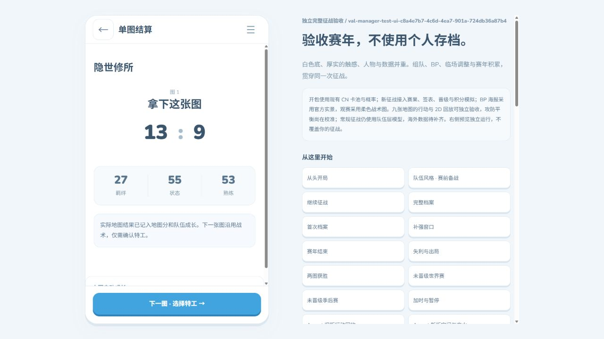

# 2026-10-08 正式精细征战闭环与接入

新开启的赛年启用 `campaign-spatial-20261008-1`，Ascent 行为 balance-5 / 空间 v5，其余八图 balance-3 / 空间 v6。赛年冻结版本表，旧赛年继续使用自己的模型，不改写历史赛果。通用旧独立预览的 approvedMaps 没有改变，新征战单独使用 campaignApprovedMaps 九图。

用户在本批明确接受三点图的进攻倾向，不再将全图/全阵容45–55%作为接入硬门槛。Lotus旧独立样本攻57.38%及部分阵容偏差仍是实测记录，不改判、不重抽、不宣称全部阵容达到平衡。先前Lotus灵活位对照失败没有接入。

## 工程验收

| 路径 | 正式地图 | 回合 | 完整恢复检查 | 结果 |
| --- | ---: | ---: | ---: | --- |
| formal-year-a，当前浏览器bundle/前端 | 31 | 583 | 2 | 八阶段结束并进入次年 |
| formal-year-b，当前浏览器bundle/前端 | 36 | 704 | 2 | 八阶段结束并进入次年 |
| formal-year-c-native，同源码Node引擎/当前前端 | 33 | 664 | 2 | 八阶段结束并进入次年，常规暂停2次/自然加时1次 |
| 胜者组真实BO5决赛签表 | 4 | 66 | 1 | EDG 3:1，两次常规暂停 |
| 败者组真实BO5决赛签表 | 3 | 62 | 1 | TYL 3:0，两次常规暂停/一次自然加时 |

三个完整赛年共100张地图/1951回合；加两条决赛专项共107张/2079回合。完整赛事前置签表和合法对手、七图BP、真实特工、精细逐分、成长、快结非玩家赛事、补强换人、资格/出局、阶段结算、荣誉参与人及次年教练/熟识继承均使用当前模块。年度重复finish和地图/系列重复结算不重复增长。JSON恢复后的下一回合、队伍和地图数据一致。A/B旧审计没有暂停计数字段，暂停覆盖来自C和决赛专项，不将未计数字段当作通过次数。

原始报告位于[summary.json](2026-10-08-spatial-campaign/summary.json)，各子目录保存完整complete.json和校验备份。385项引擎、业务与当前原型回归全部通过，见[tests-final.log](2026-10-08-spatial-campaign/tests-final.log)。原数值模型回归夹具明确固定数值分支，新增发布分支测试独立选择精细模型，历史覆盖没有被发布默认变化替换。

## 隔离浏览器验收

只使用唯一 `val-manager-test-ui-c8a4e7b7-4c6d-4ea7-901a-724db36a87b4`，未读取、重置或覆盖个人/默认数据库。通过真实导入界面恢复正式Haven第二分；对方暂停共享调整不扣我方次数，实际改动攻方优先级后继续。快进停在半场4:8；刷新后4:8、成长和免费中场窗口保留。继续到13:9，拆包播报、地图成长和下一图入口正常，结算页刷新保留结果。

事务导出界面的完整备份经career-store校验，22分对应21条后续指令，roundsSettled=22。备份见[browser-transaction.json](2026-10-08-spatial-campaign/browser-transaction.json)。IAB下载事件未返回，因此不宣称实际文件下载完成；完整证据来自界面展开的备份正文，按分段读取保存并校验。

导入已结束的测试赛年，按“开始新赛年→选择CN主队→开启三个卡包→开启本包”操作，保留逐张动效。真实事务备份确认第2年、发布ID及九图策略、默认2×、空新阵容、原教练继承和opened=[1,0,0]，见[browser-new-year.json](2026-10-08-spatial-campaign/browser-new-year.json)。

## 兼容与边界

备份校验补齐九图政策、地图对应版本、指令数量和比分一致性；未知策略/缺失版本/已打比赛降回数值/账本截断不能通过恢复校验。新赛年发布预检在冻结内容更新之前执行，配置错误不消耗卡包或更改旧内容。缓存更新为20261008-spatial-campaign-1。

恢复后首次继续需要重演当前地图的历史输入，浏览器验收中有明显等待；后续可优化分帧/Worker和加载提示，但本批没有更改冻结行为或使用重抽规避。当前二维简化不是实际三维物理复刻。既有海外两个缺卡代理、少量未核实规则例外、真机PWA/下载和长期跨阵容平衡仍见前批边界；自选/联机模式属于后续范围。

## 用户体验验收

用户从正式入口开始一个新赛年，正常完成“主队→三个包逐张揭晓→选一包选五人→赛前/BP/特工→比赛暂停/中场→补强→赛年结算”，有兴趣再开次年查看继承。主要判断局势能否看懂、BP和战术调整是否有感、抽卡补强成长是否有收获、全年操作是否疲劳；出现问题提供阶段/地图/比分和现象即可。工程闭环和去重检查由开发负责，不要求玩家证明全部技术分支。
