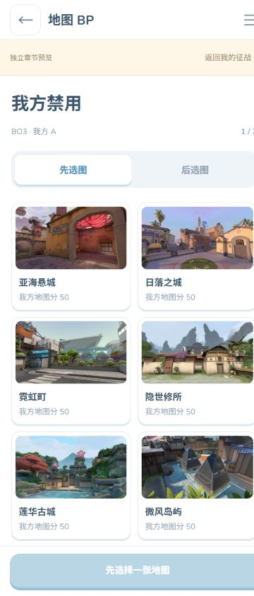
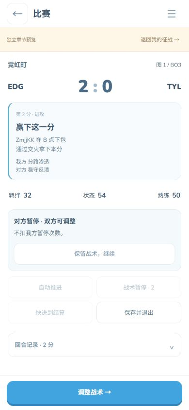

# 2026-10-09 手机征战体验与资源优化

界面发布版本 `20261009-mobile-2`，引擎仍为已冻结的 `campaign-spatial-20261008-1`，没有改写地图行为、卡牌能力或已有赛果。个人/默认数据库未用于验收，所有浏览器数据属于val-manager-test-*独立库。

## 本批完成

- 手机主界面采用内容滚动、底部导航/主操作固定的结构，三栏等宽；首页移除未开放模式占位。并列组件约束最小宽度，战术箭头维持44px触控尺寸，个人资料与特工排列适应小屏。
- BP恢复两列，区分我方/对方禁用与各图选择；规则收进折叠项。选边弹窗显示实际图号、地图名与官方海报，未确定选边时显示“待选择开局攻防”，不会默认描述成已选进攻。
- 保留原图和冻结卡牌路径，生成527张图的WebP详情/缩略版本；列表懒加载、详情按需加载。当前CN卡牌及地图等主要图片从140,955,116字节降为6,009,956字节，约减少95.7%；不是整个站点/全部代码与地图数据只有6MB。全部派生详情约10.5MB、缩略约3.9MB。
- 揭晓在主海报解码后开始，前景品质提示与卡面共用时序，底色持续保留；铜/银/金/钻结束和跳过后的卡面与背景完整，小屏无横向溢出。减少动画仍显示最终卡面。
- 精简重复口号、隐藏战力选择算法、开发参数、无效模式按钮和内部对局代码；保留资格、选人限制、战术规则、成长与备份说明。预览工具折叠，实际游戏信息仍完整。
- 普通回合不创建沙盘或逐帧绘制，只显示比分、胜负、双方战术、下包/拆包/交火等关键结果。首/换边手枪局、首次赛点、加时、胜出的残局逆转、四杀及决胜回合提供回放。关键回合可手动看本分，直接看比分时仍可在关键分重新选择观看。
- “下一回合·直接看比分”只推进一分，不重抽、不重复成长；自动推进普通战报保留约3.6秒阅读时间，倍速只影响录像。中场、对方/我方暂停都等待玩家明确继续，下一分/快进在调整窗口禁用。关闭窗口只影响后续执行。
- 所有启动JS/CSS统一版本号，SW安装刷新HTTP缓存，离线先匹配请求的精确版本再兼容旧URL；主动检查更新等待安装完成，激活更新先等待事务保存，失败不强行重载。

## 验证

398项全量回归通过：[tests.log](2026-10-09-mobile/tests.log)。新增纯展示/单分推进/JSON继续、冻结图片路径和体积/资源完整性、版本缓存及更新保存顺序测试。发布构建通过所有启动与缓存资源、HTML/CSS依赖、图片路径及大小写检查。

实际浏览器检查320/360/390/430px三栏导航全部可见；大字模式BP四宽度均为两列、无横向溢出；战术/底部按钮四宽度无溢出；320px三种品质跳过和390px金卡自然结束后卡面opacity=1、aura仍显示。选边实际显示“图2·莲华古城”；Split关键回合可以播放/暂停，点击下一分变成第2分2:0普通战报，刷新保持相同比分及对方暂停窗口，长于旧10秒期限也不自行继续。

原始数据与截图在[本批目录](2026-10-09-mobile/)。图库总体/当前游戏体积是静态文件测量，没有声称实机网络加载耗时或iOS/Android安装测试全部通过；当前图像文件总发布包仍兼容保留原图，下载路径优先派生文件。恢复后的历史模拟重演等待仍属既有引擎性能边界。

