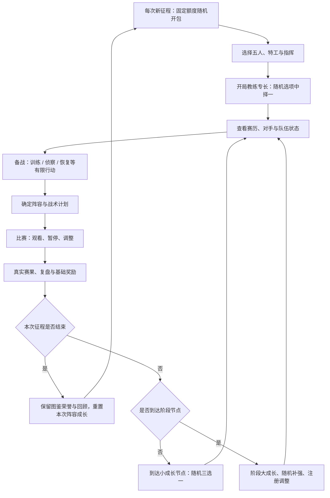

# 完整游玩流程与随机成长设计

> **历史归档（2026-10-02）**：保留过程、旧规则与研究证据，不作为当前执行规格。当前规则见[征战模式设计](../01_当前设计/征战模式重做定案与待确认事项.md)，总入口见[文档导航](../README.md)。

> **2026-10-01 规则替代说明**：当前征战设计以[《征战模式重做：已确认规则与待确认事项》](../01_当前设计/征战模式重做定案与待确认事项.md)为准。本文保留为历史提案、研究或旧测试记录；其中随机成长选择、战术卡、阵容费用、替补及旧继承规则不再作为新版实施依据。具体采用已确认规则，未决项见新稿；新版尚未写入玩法程序。

> **2026-09-23 实施入口**：[《游戏玩法与比赛引擎优化实施计划》](../../docs/plans/2026-09-23-gameplay-engine-optimization.md)已合并玩法、引擎、存档和赛事依赖，包含详细任务清单。本文保留玩法依据，最新实施顺序以统一计划为准；本轮不考虑 Jev。

> 更新：2026-09-20。
> 用户确认的核心组合：卡包随机获得起始选手 + 肉鸽式随机/阶段成长 + 教练布置与临场指挥 + 职业联赛征程。
> 用户补充：希望每次起始阵容都随机，以避免永久积累高品质卡导致后期强度失控。本文据此推荐“每次征程重新开包，保留图鉴/荣誉，重置本次阵容与成长”；具体投放、重置清单和数值仍是待验证细则。
> 现状依据：现有设计文档、引擎与 UI v2 代码静态检查。没有在本次运行玩法测试或重新测算抽卡/战斗平衡。

## 一、游戏到底在玩什么

**抽到一批职业选手，组出自己的五人队伍；在联赛中不断获得随机机会，选择成长方向、调整阵容和打法，亲自指挥他们冲击更好的成绩。**

玩家的乐趣来自四个相互支撑的部分：

| 设计内容 | 带来的乐趣 | 玩家要做的决定 |
|---|---|---|
| 抽卡 | 期待、惊喜、收藏，以及意料之外的起点 | 从开到的人中选谁、围绕谁建队 |
| 肉鸽成长 | 随机机会、组合成型、每次征程不同 | 顺着已有优势强化，还是补短板或转型 |
| 教练指挥 | 判断局势、主动干预、检验自己的理解 | 特工、职责、战术、暂停、状态干预 |
| 联赛 | 熟悉的对手、晋级压力、成绩与赛季故事 | 针对下一场准备，承担选择与赛果的后果 |

对上一版规划的修正：

- 随机获取是用户主动选择的核心玩法，不将其默认视为建队障碍。
- 不再把定向兑换/自选选手作为首版必须项；抽卡体验先在完整流程中验证。
- 随机成长是第一版需要验证的核心，而非完整联赛做好以后再附加。
- “自由组队”指在获得的选手与当前机会中自主组合，不等同于开局任选五名职业选手。
- 引用抽卡与肉鸽的设计语言，不等于必须同时引入付费、体力、UP 池、永久升星、永久死亡或随机赛程。

## 二、三层循环与成长边界

### 2.1 开包与图鉴层：这次抽到了谁，过去遇见过谁

已有卡包规则仍作为基础：四赛区、三档包、每包十张、包内不重复、品质概率按现有 v4 文档。保留每队最多一钻与同名互斥的现有方向。

每次新征程都通过固定起始额度开包获得组队候选。开出的选手决定最初有哪些组合值得尝试；功能缺口提示帮助判断，不保证每包就是最优阵容。历史图鉴记录抽到过的选手与执教经历，不等于可直接上场的永久卡库。

需要验证开包结果是否足够组成合法五人队。若极端结果使合法人数不足，应设计明确的追加随机补给规则，并单独测算其影响，不能暗改已公布的品质概率，也不必送指定高品质选手。

### 2.2 征程层：这一轮我要养成什么样的队伍

征程中获得训练成果、教练专长、战术改良和阶段事件。随机产生机会，由玩家选择；成长逐步改变队伍擅长的打法和可用手段。

建议将成长放在队伍/战术/本次征程记录上，保留选手卡的基础属性与固定特色。这样可以实现肉鸽养成，同时不必新增永久卡牌等级和升星体系。

“获得随机成长”不是“比赛结束后随机发一串属性”。每个选项应让玩家能判断用途，部分选项能与此前选择组合。

### 2.3 比赛层：这一场如何发挥已有优势

玩家根据对手、地图、经济和状态，布置并调整战术。成长提供能力和条件，玩家负责兑现；基础命令与必要信息应始终可用，不要靠抽到某条成长才能正常叫暂停或布置基本战术。

比赛中的随机发挥负责悬念；结果仍来自同一套推演。不要用奖励词条直接宣告逆转、晋级或必胜。

### 2.4 推荐解法：每次重新开包，历史收藏与上场资格分离

用户进一步明确希望每次随机开局，防止永久卡库最终变成全高品质队伍。推荐采用每次重新开包的方案：一次征程内长期执教与养成，征程结束后重新随机选手。不开设可无限积累并带入新征程的实战卡库。

| 内容 | 征程结束后如何处理 | 用途 |
|---|---|---|
| 抽到过的选手图鉴、卡面与次数 | 保留 | 收藏与开包成就，能查看但不自动获得下轮上场资格 |
| 荣誉、成绩、阵容与关键比赛记录 | 保留 | 长期执教目标与队伍故事；允许收藏某次阵容的纪念页 |
| 本次可用选手、注册阵容 | 重置，新征程重新开包 | 控制随机起点与总强度，避免永久毕业阵容 |
| 专长、训练成果、临时状态 | 按征程范围重置 | 新一轮重新组合；基础指挥功能继续可用 |
| 征程补强资源、未使用的征程卡包 | 结算后清零或转为无实战收益的记录，不带入新开局 | 防止通过囤包绕过起始额度；具体选一种结算规则 |
| 内容/挑战解锁 | 可保留，优先横向选择 | 扩充玩法，不自动提高初始属性、包档次或包数量 |

开局即说明“本次征程使用，结束后图鉴和战绩保留”，避免让玩家误认为抽到永久可出战资产。收藏记录中的卡牌与当前可用卡牌在界面上明确分开。

不优先采用“保留永久卡库，再随机封锁一部分”的方案：它既保留高品质累积问题，又增加已有选手不能使用的理解成本。也不优先用永久属性折损去压制老玩家阵容。

本次只修改设计，不执行任何已有库存删除或进度重置。关于付费抽卡、保底和定向兑换没有从本方案推导出额外设定。

### 2.5 控制每次强度的三道边界

1. **统一起点**：每次新征程给予固定起始额度，先用现有十张初始包验证。历史荣誉不无限增加起始包数量、品质或重抽次数。
2. **有限补强**：补强与固定赛段节点绑定。先小规模测试开包次数，不能按每场无限发十连；未使用资源不能无限结转到下一征程。
3. **有限叠加**：保留每队最多一钻、同名互斥；成长定义数量/等级上限、互斥和有效范围，避免高品质底板叠加无限乘算。

终局出现一钻多金不自动代表失败。应测试到达该阵容的速度和此前是否有取舍；允许玩家在征程后期完成强队构筑，下一次再从随机起点出发。

若测算发现第一阶段就普遍一钻四金，先减少或推迟补强投放，再考虑更细的招募选择。薪资帽/阵容预算属于后备方案，会增加规则负担，不作为首版必加系统。重置解决跨征程膨胀，投放和叠加限制解决单次征程内膨胀，两者都需要验证。

### 2.6 征程长度与失败

建议完整目标以一个赛年为一次征程；阶段成长跨同一赛年的赛段保留，年度结算后按规则重置本次构筑。首版用一个赛段作为可完成的测试征程，先验证成长节奏；不要同时宣称赛段结束和赛年结束都会清空同一套成长。

一场失利不结束征程。常规赛按积分继续，淘汰赛失利结束该项赛事，未获得国际赛资格则进入有限的间歇准备和下一赛段。测试版在赛段结束时结算，完整赛年版按日历继续。

赛果、资格和荣誉保留其后果；不中途为了“防卡关”发放假的晋级。同一征程的多个赛段之间继续使用本次选手与成长，只在整个征程结束后重新开包；比赛历史保留。

## 三、完整游玩流程

图中的三选一与备战行动是建议交互，以下明确触发、选择和后果。

### 3.1 开包与起始建队

**玩家经历**：选赛区卡包→开包→看新选手→选五人→选特工→指定指挥→确认队伍主要优势与风险。

**玩家思考**：“这次开到了两名适合突破的选手，要不要围绕快攻建队？还是用另一人补齐信息能力？”

**需要提供**：真实卡库、卡牌比较、合法阵容校验、英雄池/功能提示。原开包特效可复用。

此时不立即抛出大量随机词条。先让玩家知道自己有哪些人，再进入第一次成长选择。

### 3.2 开局选择教练专长

建议从已实现的专长池随机给出三项，由玩家选一项，作为本次征程的起始方向。

候选方向示例：强调团队突破的进攻组织、强调信息与转点的战术准备、强调逆风处理的临场稳定。不要把所有进攻/信息/恢复能力排他锁死；专长改变优势，不剥夺基本玩法。

选择要显示影响范围与条件。例如“提高已有烟闪配合的执行效率”，而不是只显示“史诗教练祝福”。

### 3.3 查看下一场与安排备战

下一场对手由赛程决定。玩家可在有限备战机会中选择训练、侦察或恢复；候选训练项目/事件可以随机，但基本备战入口稳定存在。

不同准备争夺同一个机会，产生明确取舍：强化现有打法、了解对手、处理近期状态。初期可用“每个备战节点一次行动”，暂不新增复杂体力和多货币。

肉鸽路线选择放在赛事之间的准备方式上；不允许为了刷简单对手任意改写正式赛程。界面主路线优先采用赛历与晋级树，随机节点作为赛历中的机会。

### 3.4 赛前布置

结合对手信息、地图、当前成长与近期状态，确认五人、特工、IGL、进攻与防守计划。换人仅发生在允许的注册窗口；可在每场调整的项目另行写清。

界面同时说明当前构筑：哪些训练成果生效、哪些需要某种行动或角色才触发。不能只列一排玩家无法判断的增益图标。

### 3.5 比赛与临场干预

沿用现有模拟与回合间教练窗口。玩家看得见计划如何执行、哪些成长触发，依据近期事实调整战术或稳住队伍。

初期先接通已有战术族、权重和 IGL；新增命令必须对应引擎行为。成长可以增加一个有条件的选择或改善执行，不自动替玩家换成所谓最优打法。

观看/加速/关键回合模式只改变呈现。快速结算需明确沿用玩家计划还是委托 AI；相同初始状态与决策序列下，播放速度不影响结果。

### 3.6 赛后复盘与小成长

先展示比分、赛事影响、关键问题与成长触发记录，再给出奖励和下一步。

建议原型先按“每完成一场正式对阵提供一次小成长选择”测试。这里一场 BO3 整体算一次，不能按每张地图重复发奖；额外练习赛不无限提供正式成长。

输赢都可获得基础成长机会，胜利增加成绩与额外资源。让失败玩家有修正打法的机会，同时不通过输球奖励更高来鼓励故意败赛。

节奏过密时改为隔一至两场触发；该频率是待试玩参数，不预设每张地图、每个回合都弹选择。

结算先判断征程是否结束。最后一场之后不再要求玩家选择即将清空、无机会使用的训练成果；直接进入成绩与荣誉结算。普通成长与阶段大成长同节点发生时合并呈现，避免连续多层弹窗。

### 3.7 阶段结算、大成长与随机补强

在赛程明确的阶段节点，提供比普通赛后更有影响的成长选择，例如升级已选打法、取得互补专长、有限次数的整顿重配。

同时按奖励规则发放卡包，并在注册窗口允许用新选手补强。新卡可能强化已有打法，也可能引发转型。

区别三种收益：**小成长**改善局部执行；**大成长**改变构筑方向或组合上限；**卡包**改变可用选手。不要三者都只变成总体战力加分。

未入围下一项赛事的队伍仍有有限备战安排，但不能在间歇无限刷到高于参赛者的成长总量。阶段机会数与整个赛历绑定。

### 3.8 征程结束与再次开始

展示最终成绩、使用阵容、成长选择轨迹、代表比赛与关键选手表现。总结的是这一次队伍的经历，不按未发生的剧情生成荣誉。

明确列出“保留”和“重置”的内容，再进入新征程。长期解锁优先扩充专长/训练/事件的选择空间；是否增加永久数值及上限单独设计，避免让后续征程自动失去挑战。

## 四、随机成长如何有组合乐趣

### 4.1 成长内容的四类分工

| 类型 | 常见节点 | 作用 | 第一版边界 |
|---|---|---|---|
| 教练专长 | 开局、重大阶段 | 提供整体打法倾向或干预特色 | 一项起始专长 + 少量后续分支，避免复杂天赋树 |
| 训练成果 | 普通赛后/训练机会 | 在可验证条件下改善团队执行 | 条件、对象、持续时间、叠加规则可见 |
| 备战/状态事件 | 比赛之间 | 让玩家权衡当前准备和未来成长 | 有限事件池；不强加一套伤病/合同经营 |
| 随机补强 | 阶段奖励/窗口 | 新选手带来人员与战术变化 | 复用现有卡包，不在比赛中抽人换人 |

### 4.2 三种可测试的成长路线（示意，非最终技能）

| 路线 | 起点 | 中途选择 | 组合形成后的体验 | 边界 |
|---|---|---|---|---|
| 团队突破 | 阵容已有突破与支援能力 | 同步烟闪训练→首轮交火后的补枪纪律 | 玩家组织配合进点，较少发生突破手脱节 | 消耗已有技能；支援阵亡或技能不足时不凭空生效 |
| 信息转点 | 阵容信息与意识较强 | 信息共享→转点集结训练 | 获取可靠信息后更好组织转点，绕开集中防守 | 不展示对手真实隐藏计划；情报不足仍有判断风险 |
| 逆风调整 | 阵容稳定性与指挥适合拉长对抗 | 暂停整顿→下包后协同训练 | 局势不利时调整节奏，进入有组织的守包 | 不奖励主动送分；守包效果只在对应场景生效 |

数值成长可以存在，但需要配合功能、触发条件或机会成本。简单的“协同提高”可作为入门选项，整套成长不能最终只剩无条件三维叠加。

### 4.3 选项生成与随机感的边界

- 三选一中至少包含当前可用的选项；不要全部要求不存在的特工或尚未实现的机制。
- 可以适当提高已有路线相关选项的出现机会，同时保留转型与通用选择；不强制每次给最优组合。
- 重复选择同一成果需有明确上限；互斥项提前显示，不用隐藏规则吞掉玩家收益。
- 每项成长标明适用于队伍、某张地图、某种战术还是某位选手。第一版优先队伍/战术成长，减少换人后进度处理的复杂度。
- 需要有限纠偏入口，例如阶段一次调整或放弃选项获得小额通用准备收益；具体选一种验证，不先堆满重抽、洗点、兑换系统。
- 不随机剥夺已获得核心选手、不因一次事件直接判负、不通过看不懂的暗改概率决定赛季。
- 随机发生在“给什么机会”；玩家负责“选什么、怎么用”。战斗随机另行平衡，不让起手、成长、心态和交火同时无限放大坏运气。

### 4.4 选手特色、暗属性与成长分开

选手的固定金卡特性/钻卡机制体现“他是谁”；征程成长体现“这次如何执教这支队伍”；局内心态体现“此刻发生了什么”。

抽卡时随机生成、完全隐藏的个体词条可以以后补充。它不是本次肉鸽成长的替代品：三选一的意义在于玩家看懂并主动选择。

若未来仍保留同名卡个体差异，自动分解重复卡与保留观察的矛盾仍须解决。第一版可先用固定选手能力 + 可见征程成长验证组合深度。

## 五、当前状态与增改清单

P0：第一版抽卡—成长—比赛循环必须具备。P1：完整赛段与首轮内容扩充。P2：核心成立之后。

| 优先级 | 内容 | 目前状态 | 需要新增或修改 |
|---|---|---|---|
| P0 | 卡包与组队接通 | 有 v4 规则、卡池和演出；主 UI 仍有示例抽卡 | 真正开包入库、十张结果、合法五人、缺额处理、库存保存；不先改概率 |
| P0 | 普卡/钻卡身份与比赛接入 | 当前队伍解析主要读取普卡表，按姓名定位 | 合并可用数据入口，区分选手/卡版本，应用同名互斥与一钻限制 |
| P0 | 玩家赛前控制 | 自动分特工，教练属性会混合预设战术 | 指定特工、IGL、计划传入比赛；手动计划不被静默改写 |
| P0 | 征程成长状态 | 未见完整 run/成长选择系统 | 保存已选成长、阶段、待选奖励、事件、适用对象、到期与重置规则 |
| P0 | 成长内容与三选一 | 原型有状态示意，暂无随机成长内容通路 | 小型可见词条库、候选生成、选择/互斥/叠加、成长总览 |
| P0 | 成长作用于比赛 | 有 hooks、心态和技能底座，尚无征程成长注册流程 | 加成接入、生命周期、触发日志；队伍选择改变实际执行 |
| P0 | 教练观察与反馈 | 有回合窗口与观赛模板，UI 操作多为示意 | 真实指令、近期状态、成长触发、可执行复盘建议 |
| P0 | 比赛间准备 | 训练入口主要是占位 | 一次有限备战选择、少量随机事件；状态持续范围清楚 |
| P0 | 奖励与存档 | 尚未发现完整游戏持久与结算闭环 | 成长/卡包只领取一次；待选项和种子持久，刷新不免费重抽 |
| P0 | 固定对手与最小赛程 | 有样例队伍、AI 和固定 UI 结果 | 少量有区别的对手、实际赛果、成长节点、胜负分支 |
| P0 / P1 | 阶段成长与完整赛段 | 有赛事框架，无真实赛历运行 | P0 切片至少一个阶段选择；P1 补齐积分、同分、晋级、淘汰、注册窗口与间歇机会预算 |
| P1 | 地图与系列赛 | 目前主要单图推演 | 目标赛事需要的地图、BO3/BO5 和 BP；单图测试明确标注 |
| P1 | 开包/成长平衡 | 原开包强度模拟主要基于旧规则，战斗报告未覆盖成长组合 | v4 出卡与合法阵容测算、不同起手下成长适配、叠加上限与收益 |
| P1 | 代表性选手机制 | 有方向/数据，尚未完整接入观赛比赛 | 实际能力、成长联动和表现反馈，不把特工技能当成选手专属 |
| P0 | 征程结束与继承 | 有生涯示意；用户明确希望每次随机开局 | 落实图鉴保留、实战阵容/成长重置、征程资源不能跨轮囤积 |
| P2 | 完整赛年与长期系统 | 方向已有 | 国际赛、跨赛年、内容解锁、更多成长路线、深层暗属性 |
| P2 | PVP 与运营 | 规划后置 | 征程构筑如何带入对战另定；不阻挡单人模式验证 |

第一版建议新增页面/面板：开局专长选择、赛后成长三选一、备战事件、队伍成长总览、阶段整顿、征程继承结算。复用现有卡面、阵容、观赛与征程视觉资产。

## 六、需要同步修改的旧设计

1. **建队定位**：把“必须尽早组出指定梦之队”改为“抽到的起点中自主建队，收藏目标可以长期追求”。定向获取/保底仅作为需要测试的可选优化。
2. **成长优先级**：将可见的随机成长与阶段选择提到 P0；永久数值养成与大型暗属性库仍可后置。
3. **核心流程**：从连续点击比赛变为比赛—复盘—成长选择—备战—下一场。成长必须影响后续决定。
4. **教练三维**：先明确它与专长/训练的关系，避免同一份收益重复计入多个乘区。三维可以保留，但不能替代玩家的成长选择。
5. **晋级规则**：比赛决定成绩，成长影响比赛；不能用成长总评分直接决定晋级。
6. **事件与赛历**：随机准备机会嵌入固定联赛，不能把所有赛事改为任意选择敌人的关卡树。
7. **失败路径**：一场输球不等于肉鸽死亡；按赛事规则淘汰，按征程边界结算。不可将“失败也有成长”做成可刷奖励漏洞。
8. **状态层级**：单回合效果、单场心态、数场状态、本次征程成长、长期收藏分别标记；不能把原型 hot/cold 和 chemistry 当作已实现规则。
9. **数值验证**：除卡牌档位与战术平衡，还需比较不同随机起点、成长路线、叠加组合和阶段强度。
10. **原型接入**：v2 页面中固定赛果、示意抽卡和假暂停须接真实状态。界面展示的效果应与实际能力一致。

## 七、实施顺序

### 第一步：冻结随机与继承边界

按“每次重新开包、图鉴与荣誉保留”细化首版征程长度、成长何时提供/何时重置、卡包奖励节点、选项持续时间、败赛后去向。以本文件为草案，不以等待全部词条定稿为开发前提。

### 第二步：打通开包—组队—一场真实比赛

复用 `数据源/cards_full.json`、`diamond_cards.json`、`引擎/teams.js`、`agents.js`、`coach.js`、`match.js` 和 UI v2，完成持有、阵容、指定特工与手动计划。加入基本存档，展示真实结果。

### 第三步：打通“打一场—选成长—再打一场”

这是新方向的第一个核心验收点。新增征程状态、选项生成和效果应用，复用 `hooks.js`、`events.js`、`report.js` 的适当接入点，必要时补充行为事件；不假设现有 hooks 足以支撑所有训练效果。

内部切片建议先用三至五场对阵、三条成长方向、约十二项成长、四至六个备战事件、一个阶段大成长和一次补强窗口。数量只是工作量起点，不是已验证的最终内容规格。

### 第四步：补齐临场反馈并扩展完整赛段

显示成长触发与状态变化，验证暂停决定；加入目标赛区对手、积分/晋级、系列赛、阶段奖励和失败分支。第一版若仍用 BO1 单图，明确标记为简化测试赛段。

### 第五步：验证随机体验与重复游玩

固定阵容比较不同成长，固定成长比较不同阵容，多种种子检查起手下限与可用选项。同步观察玩家是否看得懂、是否愿意换一种构筑再玩。

核心成立后再扩展国际赛、完整赛年和图鉴/荣誉目标；不要先用大量成长条目填满尚未验证的循环。

## 八、实现与测试必须守住的边界

- **数据分层**：卡牌基础数据、持有记录、征程成长、比赛状态分别保存。成长不能写回原始卡池，更不能误改 AI 对手共用对象。
- **随机分流**：开包、事件候选和战斗使用可记录的独立随机序列。调试一场比赛不应意外改变下一次成长选项。
- **待选项持久化**：生成三选一时保存结果、节点与领取标记；刷新/返回不免费重抽、不重复领奖。
- **效果协议**：每项成长至少定义条件、目标、效果、持续范围、上限/互斥、说明与日志。乘区与应用顺序统一设计。
- **切换与到期**：换人、换地图、阶段结束或新征程开始时，效果按对象与生命周期处理；不残留、不重复叠加。
- **对手规则**：能力与战斗规则一致。对手可使用预设阶段构筑，首次引入时限制预算并清楚标识，不用隐形全属性暴涨追赶玩家。
- **有效选择**：检测三项全部无效、满级重复、互斥死路、永久不可逆废选项。保留有风险选择，但玩家应理解风险。
- **赛事正确性**：正式对阵唯一结算；系列赛不按每张图重复发成长；练习赛与间歇不可无限刷。
- **可解释性**：事件日志能核对成长触发与指令执行。短期输赢不是单次选择有效与否的唯一证据。

## 九、首版完成标准

1. 开包结果真实入库，玩家能从随机起点组成合法队伍。
2. 阵容、特工、IGL 和战术确认后进入同一场真实比赛。
3. 至少两次有区别的成长选择实际影响之后的比赛与备战。
4. 至少出现一次“继续强化已有路线”与“补短板/转型”的可理解取舍。
5. 玩家能观察到指挥、成长和状态的具体作用，知道输球后可尝试什么。
6. 能完成一个测试征程，胜利、连败、淘汰均有清楚结算与后续入口。
7. 卡包、成长、阶段奖励和存档一致，刷新不改变已生成结果或重复领奖。
8. 玩家知道哪些内容保留、哪些重置；愿意因为新的阵容或成长组合再试一次。

这套方案的设计重点是：随机给起点与机会，玩家在有限条件中构筑队伍，再通过真实比赛检验选择。
