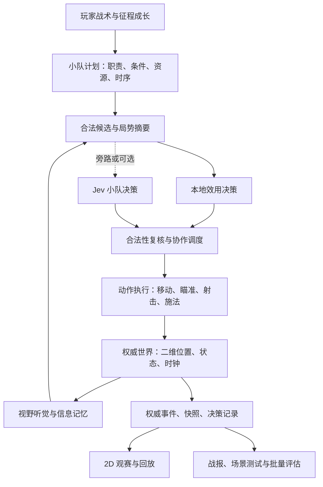

# 比赛引擎改进方案与 Jev 评估

> **历史归档（2026-10-02）**：保留过程、旧规则与研究证据，不作为当前执行规格。当前规则见[征战模式设计](../01_当前设计/征战模式重做定案与待确认事项.md)，总入口见[文档导航](../README.md)。

> **范围更新（2026-09-23）**：用户已要求先不考虑 Jev。本文件保留引擎审计和模型研究记录，其中 Jev 旁路/在线阶段不再属于当前待办。最新引擎与玩法任务、依赖及验收以[《游戏玩法与比赛引擎优化实施计划》](../../docs/plans/2026-09-23-gameplay-engine-optimization.md)为准。

> 日期：2026-09-23。状态：改进提案，未修改引擎实现。
> 用户优先级：选手走位、交火和技能使用不像真实比赛的问题最显著，战术执行与临场调整效果次之。
> 范围：现有代码审计、本地小样本检查、Jev 官方资料核实、架构与实施方案。没有调用 Jev API，没有实际测得模型在本项目中的效果或延迟。

## 一、结论与目标

**建议将现有“区域节点 + 概率击杀”逐步升级为“有实际二维位置、视野、动作耗时和小队协作的战术模拟”，保留本地结算，按需实验 Jev 的局势决策。**

当前已经具备经济、选手属性、技能原型、回合驱动、战术意图、回放和批量模拟，不需要全部推倒。问题集中在底层表示过粗、部分规则捷径、信息越界和执行缺乏时序。接入更强决策模型不会自动修复这些问题。

目标是一回合中能够看清以下过程：

1. 选手沿可走路径移动，进出掩体，移动途中也能被发现和交火。
2. 防守方根据真实可得信息反应，错误判断来自信息不足或选择，而非人为标记“这是假打”。
3. 烟、闪、侦察和突破按可观察的时序配合；支援不到位时计划会等待、降级或失败。
4. 首次接触、瞄准、开火、命中、退回掩体和补枪有连续因果。
5. 下包后仍要经历回防与拆包，剩余时间能真实改变胜负。
6. 改变教练计划或肉鸽成长后，首先表现为行动/能力变化，再影响赛果。

拟定边界：保留俯视 2D、简化命中与技能几何、有限动作集；首轮不做完整 3D、逐发弹道物理或所有特工的完全还原。

## 二、现状：哪些机制正在影响真实感

以下区分代码事实与体验推断。未实地观看本次浏览器演出，因此“看起来可能如何”是根据实现作出的判断。

| 项目 | 检查到的实现 | 对体验的影响与建议 |
|---|---|---|
| 节点内视野 | `gamemap.js:62` 的 `canSee` 将同节点点位视为可见；`combat.js:130` 同节点交火不走跨节点枪线遮挡检查 | 角落、门口与烟内外缺少统一约束；增加实际几何视野，所有交火共用同一合法判定 |
| 移动中交战 | `movement.js:29` 移动时从占用表移除并释放 post；主要跨节点交火只考虑静止架枪者 | 移动路径缺少持续暴露与拦截；位置和碰撞体应持续存在 |
| 寻路 | `gamemap.js` 用 BFS 按边数确定下一跳，而边另有耗时与暴露值 | 不能依据真实时间、危险与静步方式选择路线；改用加权路径代价 |
| 命中模型 | `combat.js:33` 每次直接 roll 击杀；未见完整 HP、弹药、反应/瞄准/开火状态 | 难表现残血、换弹、探头和火力窗口；增加有限交战动作与伤害状态 |
| 补枪 | `combat.js:83` 在队友死亡后，同节点队友立即按概率反击 | 缺少距离、视线和反应延迟；改为基于感知触发、有时限的补枪任务 |
| 时间粒度 | `config.js` 定义 1 tick = 1 秒，常规个体思考每 3 tick 一次 | 一秒内的烟闪、横拉、补枪难表达；动作时间与战术思考解耦 |
| 信息读取 | `round.js:233` 中路判断遍历实际防守分布；部分侦察直接统计两点人数 | 决策可能用到尚未获得的信息；引入逐单位观测与队内信息记忆 |
| 假打识别 | `perception.js` 的信息携带 `suspicious` 标记；假打动作直接写入该标记 | 把部分真假答案提前给了 AI；应由信号、来源和后续佐证形成判断 |
| 战术组织 | `tactics.js` 提供族、路线和时间先验，个体效用独立竞争；rush 五人均为 hit | 缺突破、支援、补枪、携包等职责协调与等待条件；增加小队执行计划 |
| 技能 | 有多种原型，但部分技能是节点修正、到达后反应触发；治疗等为代理效果 | “用了技能”和“正确时机的技能配合”尚有差距；先选少数原型补齐准备—生效—结束 |
| 真人控制 | `coach.js` 的赛前初始化会将战术与预设 meta 混合 | 真人模式需要保留玩家确认的计划，自动教练只负责获授权的调整 |
| 2D 演出 | `spectator.template.html:212` 从节点中心向目标点插值；部分效果时长由渲染重新估计 | 演出位置不完全等于战斗位置，可能出现跳位/效果错时；渲染消费权威位置和事件 |
| 回合驱动 | `RoundSim.run()` 同步跑完回合，`matchGen` 在回合结束后 yield | 当前不是逐 tick 等待外部模型的架构；在线接模型需额外调度，不可直接塞一个 await |

### 2.1 两项已经确认的规则问题

**A. 下包后进攻方全灭会直接判定防守方拆包获胜。**

`round.js:346` 不再等待抵达爆能器、开始拆包和完成拆包。它会移除“杀光对手但来不及拆”的残局结果，也会影响守包和拖延技能的价值。

本次用 CLI 对应的固定双方阵容和种子序列检查 30 场、613 回合：128 次结果标记为拆包，其中 126 次没有 `defuse` 完成事件，样本中的实例在最后击杀时立即结束。该统计证明捷径大量生效，不意味着这 126 局在修正后都会翻转结果。

**B. 同步进点降低被抢先概率的条件未生效。**

`combat.js:114` 使用 `sync >= C.syncMin`，但当前 `config.js` 未定义 `combat.syncMin`。运行时比较结果为 false。要先明确设计阈值并补上回归测试，不应把收益缺失归因于 AI 不够聪明。

### 2.2 本次本地验证记录

命令：`node 引擎/sim.js --a tiers:GGSSB --b tiers:SSSSS --n 30 --seed 42`。

结果：完成 30 场，平均 20.4 回合，攻方回合胜率 45.0%，回防成功率 31.7%；CLI 报告约 82.9 场/秒。这是当前机器的小样本运行，不是性能承诺，也不足以重新定平衡。

另以内存 logger 逐回合统计 `round_end.reason === 'defuse'` 与实际 `defuse` 事件，得到上述 128/126 结果；无新增比赛输出文件。规则修正后必须重跑基础分布，不能要求沿用旧错误逻辑下的胜率矩阵。

## 三、Jev 能帮什么，不能替代什么

### 3.1 已核实的模型性质

截至本次核查，TypeSafe 的 Jev 提供 Choice、Score、Noul：在给定状态上做有界选择、评分或真假概率判断；它不生成自由文本。多个问题可批量评估，但彼此独立，不能因此假设十名选手自动协作。[官方介绍](https://docs.typesafe.ai/introduction)

当前官方模型页列出 `jev-1.13.0`，输入为文本/JSON，不直接接受图像视频；价格为每百万输入 token 0.042 美元，输出免费。模型版本可固定，别名会变化。官方未提供客户微调/LoRA 路径。[模型说明](https://docs.typesafe.ai/models)

官方发布材料给出 70–500ms 的调用示例范围，并说明主要在美国西海岸测量；这不是中国网络环境、游戏并发负载或尾延迟的保证。[发布说明](https://typesafe.ai/blog/introducing-system-one-models-and-jev)

官方明确提示其数值计算、复杂间接推理和无关长上下文存在局限；精确算术应保留在代码中。[能力边界](https://docs.typesafe.ai/model-jaggedness/jev-1.13)

Choice 的概率是选项分布，confidence 来自该分布；不能直接当作游戏中的成功率或选手能力。高 confidence 也不自动证明战术判断正确。[Confidence](https://docs.typesafe.ai/confidence)

### 3.2 推荐用途

**优先实验小队/IGL 层的少量事件决策：**

- 信息不足而时间尚可：继续取信息，还是执行原计划？
- 突破手阵亡、支援仍在：继续进点，还是退回重组？
- 当前入口受阻：等待技能、换入口，还是转点？
- 下包后接到有效敌情：继续守当前枪线，还是重新分工？

本地代码先生成合法候选、计算时间/路径/资源约束，Jev 再选择。候选不包含不可达、无技能、来不及完成的动作。

后续可以试做离线残局标注、对手战术建议和模型/规则分歧归类。模型意见是参考，不作为真值标签；专家复核与实际推演决定结论。

**保留本地负责：**几何、碰撞、寻路、视野、技能范围、反应计时、命中/伤害、弹药、经济、下拆包、胜负、随机数与合法性。

让模型直接判断“谁打死谁”、生成整回合结果或凭画面推测世界状态，会削弱可复现性，也没有解决目前最主要的问题。

### 3.3 接入方式：先旁路评估，再可选在线

1. 从本地比赛导出带视角限制的局势快照与合法候选。
2. 本地 AI 继续运行，离线请求 Jev 对同一快照选择，不影响玩家比赛。
3. 对保留的候选作相同预算的后续推演，并与人工标注比较。
4. 只有在行为可信度、非法/无效决策率和延迟成本上通过门槛，才给它在线决策权。
5. 在线版仍保留本地策略作为默认和兜底，断网或额度耗尽能完成比赛。

不承诺 Jev 比当前 AI 或改进后的本地 AI 更强。本次没有 API 实测，没有为项目开通付费服务。

## 四、推荐引擎结构

此结构中的单位事实、时间与胜负只有一个权威来源。AI 只能读取自己的观察，观赛与调试可以切换全知视角；全知画面不能反向成为 AI 输入。

### 4.1 空间：区域负责规划，二维几何负责执行

保留现有区域图用于宏观计划，增加可行走区域、墙体/障碍、门口和局部路径点。单位持续拥有坐标、朝向、速度和碰撞半径；现有 post 可转为战术参考站位。

第一步在当前地图的一个包点及相连入口、回防路线完成几何验证；然后再覆盖整图。避免一次性重做所有地图。

路径代价考虑长度/时间、已知危险与静步方式。初期使用简化网格或稀疏路径图即可，具体以地图编辑成本和运行测量选择；不要先引入复杂 3D 导航。

移动中的单位仍可被看见与命中；朝向、墙体与烟区统一参与视线检测。技能穿墙、侦察等明确例外由具体规则处理。

### 4.2 时间：固定逻辑步长与多个决策频率

建议原型测试 100ms 的固定逻辑步长；渲染按设备帧率插值，AI 战术决策按较低频率或关键事件触发。精确步长是测试参数，不是先验性能结论。

小队计划可以每 0.5–1 秒检查条件，交火动作按既定计时推进；不要求每次绘制都重新决策。换枪、装填、施法和收枪都有可见耗时。

需要修正概率的时间单位：原“每秒击杀率”不能原样改成“每 100ms 判定率”。使用每次射击判定，或对连续风险使用 `p(dt) = 1 - exp(-lambda * dt)` 等时间一致的换算，再重新校准。

每个逻辑步先读取一致快照形成意图，再按明确的事件时间/优先级执行，防止数组顺序决定哪队永远先行动。记录相同时间的稳定排序规则。

### 4.3 信息：从真值读取改为有来源的观察

每个单位保存可见敌人、最后目击位置/时间、听到的声响、可确认的技能信息。队内共享有时间和来源，不等于全图透视。

位置记忆会变旧，声响只能说明可能范围，空侦察只排除实际覆盖区域。假打能否奏效由信息、时间和后续行动形成，不直接向防守 AI 发送“假打=true”。

意识影响观察整合、风险判断和反应分布；低意识可以判断不好，但不应随机违反基本规则。把模型接到过滤后的观察接口，防止模型与本地 AI 获得不同信息优势。

### 4.4 交战：从直接击杀改为有限动作状态机

建议最小链条：发现/预瞄→反应与转向→开火→命中伤害→压枪/再次开火或撤回→弹药耗尽装填。

采用简化即时命中与概率误差，不模拟完整子弹物理。枪法影响瞄准误差、射击稳定和动作效率；移动、距离、暴露、致盲和护甲影响对应环节。

HP 与护甲让“残血、治疗、技能伤害、保枪”有实际含义。先做有限武器档位，不把完整枪械手感还原当作首轮前提。

补枪由队友的目击/报点、距离与枪线触发：需要发现目标、完成反应并获得射击机会。协同改善跟随距离、准备程度与交接，不能在队友死亡时无条件立即回击。

### 4.5 战术：有职责、有同步条件、有失败分支

在个体效用之上增加小队执行层，先支持三套可解释模板：同步进点、接触后转点、集结回防。

每套模板包含：角色分配、目标区域、集合条件、技能资源预约、开始时间窗口、推进触发、失败/超时分支、允许个体偏离的范围。

例如“同步进点”：烟位就绪→闪位确认→突破手等待短窗口→烟生效/闪爆后进入→补枪手保持距离→携包者安全跟进。闪位阵亡时按计划改为等待、换打法或冒险强进，不能仍执行不存在的技能配合。

角色按特工能力与玩家指定分配，不简单按数组第一个当突破/携包。IGL 负责组织和信息分配，而不只是全队属性光环。

个体层继续处理躲伤害、临近交战、失去目标后的反应；任务承诺时间与中断条件避免反复横跳。小队协调器处理同抢站位、多人重复交同类技能等冲突。

### 4.6 技能：先把五类行为做可信

首轮重点是烟、闪、侦察、区域伤害、突破位移。每类定义准备、释放、生效、持续、结束与资源消耗；实现后再映射更多特工。

- 烟改变视线；穿烟仍有位置、声音和风险，不只给一方增加移动秒数。
- 闪根据位置、遮挡和朝向施加持续致盲；队伍必须按时序跟进。
- 侦察只报告覆盖区域内实际检测到的信息。
- 区域伤害带来绕行、等待、受伤与下拆包中断风险。
- 位移必须实际改变坐标与暴露轨迹，不只移除一个命中惩罚。

完整资源规则逐步收敛到技能购买/充能，避免通用道具点与专属技能充能双重供给；此处属于下一轮专项数值工作。

### 4.7 2D 演出：呈现引擎实际发生的事

渲染读取权威位置快照与动作事件，不重新根据节点中心猜移动轨迹或技能持续时间。事件增加：移动/停止、发现/丢失目标、瞄准、射击、命中、施法起止、效果起止、任务切换、下拆包进度。

画面提供正常观赛和解释模式：前者突出比赛，后者显示职责、目的地、观察到的敌情、技能等待状态和任务变更原因。显示理由来自结构化事件，不假装拿到了模型的推理过程。

明确玩家可干预窗口仍是赛前、回合间、中场与暂停。引擎可以逐 tick 推演，但不默认增加用户未要求的实时微操。

## 五、Jev 的具体接口方案

### 5.1 输入与输出职责

输入只包含：己方合法观察、小队职责、玩家意图、已有成长、必要资源，以及代码算好的候选摘要。时间是否足够、路径是否可达、技能是否可用由本地计算。

示例候选：`continue_plan`、`wait_for_support`、`regroup`、`rotate_B`。每个候选附具体行为、已知风险和可用条件；不让模型生成任意坐标、命令字符串或代码。

初期每次只问一个小队决定。若批量问多名单位，不能把它们不同视角的私有观察合并成公共 state；同一批多个回答也必须经过小队调度器处理资源冲突。

### 5.2 执行时序与降级

- 提交请求时记录局势版本、仿真时间、决策截止时间、候选集合与本地兜底动作。
- 返回时重新检查存活、位置、技能资源、计划版本及候选合法性。死亡队员不能执行迟到的模型指令。
- 超时、限流、错误、低可信或局势过期时使用本地策略；阈值由项目样本标定，不随意把 0.8 当作通用正确率。
- 已超时决策的迟到结果丢弃；重试不能让同一命令执行两次。网络耗时不改变单位的物理时间。
- 真人计划是边界：模型可以在授权范围内调整执行，不能越过玩家的暂停/换阵容权限。

当前同步回合循环不能直接等待远程模型。建议先保持同步本地核并做离线旁路；在线试验时再引入可暂停的 `step(dt)` 驱动与异步决策调度。本地批量平衡默认不调用远程模型。

### 5.3 回放与可复现性

仅保存种子不足以保证未来远程模型输出一致。记录引擎/地图/模型版本、输入摘要哈希、候选、采纳动作、生效仿真时刻、超时/兜底记录和成长配置。

回放消费已保存的动作/事件，不重新请求 Jev。实验比较固定版本与视角限制；模型升级需要重跑场景集。

浏览器端不放 API 密钥。若进入在线阶段，用本地开发代理或服务器服务端调用，设置额度、超时与服务熔断；模型关停后本地模式继续可用。

### 5.4 调用频率与成本草算

以下是假设演算，不是实测账单。以每回合 100 秒、每图 25 回合、每请求 2,000 输入 token、官方当前 $0.042/百万 token 为例：

| 方式 | 每图请求数 | 估算模型输入费用 |
|---|---:|---:|
| 10 名选手每秒各请求一次 | 25,000 | $2.10 |
| 每回合两队合计最多 6 次事件决策 | 150 | $0.0126 |

批量问题可以减少共享输入重复，但不会自动形成团队协作。以上不含更长问题、重试、代理服务、其他供应商费用与网络开销。按实际 token 用量、并发量和尾延迟复测后再作接入决定。[价格依据](https://docs.typesafe.ai/models)

初始试验限制每回合总请求数与并发；优先关键事件，不根据动画帧率调用模型。即使采用便宜模式，也不能让远程调用拖慢大批量平衡模拟。

## 六、分阶段实施与验收

| 阶段 | 交付物 | 重点文件/边界 | 验收 |
|---|---|---|---|
| E0 修正规则并建立场景基线 | 下拆包、同步进点、配置校验与场景夹具 | `round.js`、`combat.js`、`config.js`、新增场景测试 | 下包后全灭不自动拆包；时间不足可引爆；同步收益确实生效；重建平衡基线 |
| E1 单包点真实空间 | 路径、墙体/烟视线、连续单位位置、权威观赛 | `gamemap.js`、`movement.js`、地图数据、观赛模板 | 移动途中可被拦截；墙后不可见；同节点也遵守遮挡；回放位置与规则位置一致 |
| E2 动作交战与有限技能 | HP/弹药、反应/射击/补枪、五类技能时序 | `combat.js`、`abilities.js`、逻辑时钟 | 烟闪时机能影响进点；补枪有条件与延迟；不存在回调递归式瞬时多人互杀 |
| E3 小队执行与信息模型 | 三套战术模板、职责协调、观察记忆、解释面板 | `tactics.js`、`brain.js`、`perception.js`、`coach.js` | 假打/转点基于观测；等待与失败分支可见；手动计划不被静默改写 |
| E4 Jev 旁路对照 | 场景快照、候选接口、离线评估与成本记录 | 建议独立 `decision/` 与 `scenarios/` 模块 | 与改进后本地 AI 在相同信息和候选下比较；没有显著收益则不在线接入 |
| E5 整图与局部在线试验 | 覆盖整图、成长接口、可选 Jev 调度与回放 | `match.js`、回放/观赛、服务端适配 | 断网可完成；模型动作可复现回放；批量模拟不依赖 API；新图新增无需重写决策 |

先交付一张地图的代表性 5v5 回合：同步进点、下包、回防、残局时间判断。用它验证真实感后再扩展整图和技能覆盖。不要在每一步都重新追求全量卡池和全部地图。

Jev 的资料核实与快照样本准备可以先做，但它不阻塞 E0–E3；最早在线接入也必须建立在合法世界状态和动作接口之上。

## 七、如何判断“变好了”

### 7.1 场景测试优先于总胜率

建立以下可重复的小场景，按意图检查允许行为与结果范围：

1. 进攻全灭但爆能器即将引爆，防守距离过远或拆包时间不足。
2. 相同节点内被墙/烟遮挡，不应互相直接发现或进行普通视线射击。
3. 单位横穿已被架住的入口，途中可以暴露、受击和停止。
4. 突破与闪光错开、正确同步、支援阵亡三种条件产生不同执行过程。
5. 队友被击杀，近且有视线的队员能及时补枪；远处隔墙队员不能瞬时补枪。
6. 假打只有弱信号时部分防守维持岗位；有多源佐证时才增援，不直接读取真点。
7. 侦察覆盖一部分区域，不能获得整张地图准确人数。
8. 肉鸽“协同训练”改善跟进/同步等对应指标，不无条件提高所有交火。
9. 模型返回前队员阵亡或目标失效，旧命令被丢弃且回放记录一致。
10. 同一决策日志在不同观看速度下还原同一结果；刷新回放不再次请求模型。

每类先做少量人工可审查夹具，再用种子变体扩大。允许多种合理策略，不给所有战术场景强行标一个唯一答案。

### 7.2 测量指标

- **行为合理性**：非法视线射击、不可达移动、无资源施法、未观测信息使用、重复命令与过期动作应为零。
- **战术执行**：集合等待、支援跟进时间、技能—突破时间差、可补枪机会的实现率、计划取消/变更理由。
- **回合过程**：首次接触时间、交战持续时间、下包时间、实际拆包完成率、死后爆能器引爆等。
- **观赛可读性**：玩家能说明队员在做什么、为什么等、为什么转点、自己的计划造成了什么变化。
- **性能**：目标设备逻辑步耗时、渲染帧时间、无渲染吞吐、日志体积；记录中位与 p95，不拿旧 v0 吞吐作承诺。
- **模型**：合理选择率、回退率、动作过期率、p50/p95/p99 延迟、每图实际 token/费用，及盲评的真实感。

先确保规则正确和行为可解释，再调总体攻防、卡牌档位、地图与成长强度。不能通过给进攻方加面板属性来掩盖拆包规则或信息模型问题。

### 7.3 Jev 的采用门槛

在同一批未用于调整提示词的场景上，Jev 方案相对本地基线应改善选定决策质量/可信度，并满足玩家设备环境下的延迟与成本预算；不能有信息越权或不可重放的行为。

若仅在离线复盘有价值，就保留该用途；若本地效用 + 小队计划已经足够自然，游戏运行时继续使用本地方案。模型的品牌或演示速度不作为上线标准。

## 八、关键架构决策记录（均为 Proposed）

### ADR-ENGINE-01：区域规划与二维执行分层

**背景**：纯区域抽象难表达运动/视野与烟闪细节，完整 3D 成本过高。

**建议决定**：保留区域宏观信息，增加二维几何与连续位置，所有动作读取同一世界状态。

**代价**：地图编辑、导航、视野和时钟需要新增实现，批量吞吐可能下降。

**替代方案**：仅调原模型数值改动小但表达限制仍在；直接重做 3D 超过本轮范围。

### ADR-ENGINE-02：规则核与决策策略分离

**背景**：更换 AI 不应同时更换命中、胜负和信息权限。

**建议决定**：本地世界/规则为权威，效用 AI 和 Jev 共享观察与候选接口；小队调度器负责协调。

**代价**：需要清晰的数据边界、合法性复核与逐步迁移旧函数。

**替代方案**：模型直接控制一切集成快，但无法保证空间/时间正确性与稳定平衡。

### ADR-ENGINE-03：Jev 先旁路，运行时可选

**背景**：项目当前是本地纯 Web/Node，远程模型有网络、费用、版本和异步状态问题。

**建议决定**：先用快照做离线对照，再视证据增加服务端代理、事件调度、预算和本地兜底。

**代价**：不能立刻得到“全模型驱动”的演示；需另做模型测评。

**替代方案**：十人每 tick 请求会放大延迟/成本，批量独立问题也不等于协作，暂不采用。

### ADR-ENGINE-04：权威事件和已采纳决策驱动回放

**背景**：节点插值与渲染自算时长可能不同于规则，远程模型不能只靠种子重新获得同样答案。

**建议决定**：记录位置/动作/效果及采纳决策，回放不重新做模型推理；日志附版本与时间。

**代价**：事件量和存档体积增大，需要快照间隔、压缩及旧日志兼容策略。

**替代方案**：只保存随机种子更小，但无法满足模型模式的可靠重放。

## 九、当前最先做的具体工作

先完成 E0，并制作一个带墙体、入口、烟区和回防路径的单包点 5v5 验证场景。在这个场景中打通“等待烟闪—突破—补枪—下包—回防—限时拆包”的完整过程，然后决定 Jev 接管哪个确实需要更好判断的节点。

这份方案暂不改动抽卡和征程设计。引擎的成长接入将服务于已确认的肉鸽方向，但当前工作重心按用户要求前移到比赛真实性。
